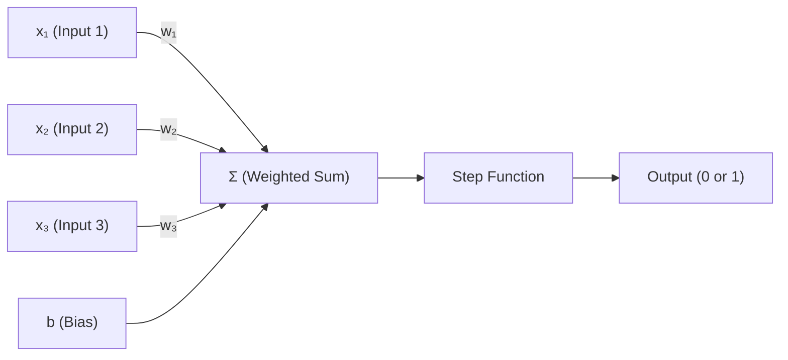
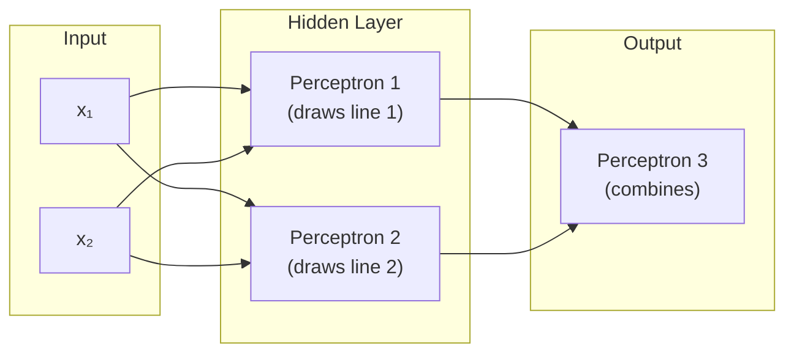

# Introduction to the Perceptron

## 1. Biological Inspiration

A perceptron is a mathematical model of a single **biological neuron**.

A neuron in the brain:
- Receives **signals** from multiple sensors/other neurons simultaneously
- Each connection has a different **strength** (some signals matter more than others)
- **Sums up** all the incoming signals
- **Fires** only if the total exceeds a certain threshold

## 2. The Perceptron Equation

$$
z = \sum_{i=1}^{n} x_i \cdot w_i + b = x_1 w_1 + x_2 w_2 + \ldots + x_n w_n + b
$$

where:
- $x_i$ = inputs (the data coming in)
- $w_i$ = weights (learned importance of each input)
- $b$ = bias (shifts the decision boundary)
- $z$ = the pre-activation value

## 3. Role of Weights

- Weights are **learned parameters** that encode the **importance** of each input
- Analogy: the brain's "withdraw hand" neuron assigns a high weight to the hand's temperature sensor and near-zero weight to the foot's sensor
- Weights are **relatively permanent** — they represent learned knowledge, not momentary data
- They control the **slope/direction** of the decision boundary

> [!IMPORTANT]
> Inputs ($x$) = temporary data flowing in (changes every moment)
> Weights ($w$) = learned importance of each input (adjusted during training)

## 4. Role of Bias

Without bias, the equation is $z = \sum x_i \cdot w_i$, and the decision boundary is always **stuck at the origin**.

**Why?** The step function fires when $z > 0$. Without bias:

$$
w \cdot x = 0 \implies x = 0 \text{ (always)}
$$

No matter what value $w$ takes, the boundary can never move away from $x = 0$.

**The problem:** Real problems need boundaries at arbitrary positions (e.g., "fire when temperature > 50°C", not just > 0°C).

**The solution:** Add a learnable number to the equation:

$$
z = w \cdot x + b
$$

Now the boundary is at $x = -b/w$, which can be **anywhere**.

> [!TIP]
> The bias was originally the "threshold" that sat outside the equation. Mathematicians moved it inside (with a sign flip) as a learnable parameter, so the activation function always just checks $z > 0$.

## 5. Activation Function (Step Function)

The **step function** is the simplest activation function — it makes the binary fire/don't fire decision:

$$
\text{output} = \begin{cases} 1 & \text{if } z > 0 \\ 0 & \text{if } z \leq 0 \end{cases}
$$

The zero threshold is fixed by design. The bias handles shifting the effective boundary in input space.

## 6. Decision Boundaries

A single perceptron draws a **linear** decision boundary. Its dimensionality scales with inputs:

| Inputs | Boundary Shape | Space |
|---|---|---|
| 1 | Point | 1D number line |
| 2 | Line | 2D plane |
| 3 | Plane | 3D space |
| n | Hyperplane | nD space |

The boundary is always **one dimension less** than the input space.

## 7. Limitation — Linear Separability

A single perceptron can **only** classify data that is **linearly separable** (separable by a straight line/plane).

**Classic failure case — XOR:**

| $x_1$ | $x_2$ | Output |
|---|---|---|
| 0 | 0 | 0 |
| 0 | 1 | 1 |
| 1 | 0 | 1 |
| 1 | 1 | 0 |

The 1s and 0s sit diagonally opposite — no single straight line can separate them.

> [!WARNING]
> This is not a training problem. The solution simply **does not exist** within what a single perceptron can express. No amount of backpropagation can fix a model that can't represent the answer.

## 8. Why Neural Networks

Stacking multiple perceptrons in **layers** overcomes the linear limitation:

- Each perceptron in a layer draws its own linear boundary
- The next layer **combines** these boundaries into complex, non-linear regions
- Enough layers can approximate **any** boundary shape

> **Single perceptron** = one linear boundary → limited
> **Multi-Layer Perceptron (MLP)** = complex, non-linear boundaries → powerful

---

## Navigation
- [<- Back to Index](00_Index.md)
- [Forward to Forward/Backward Propagation ->](02_Forward_Backward_Propagation.md)
