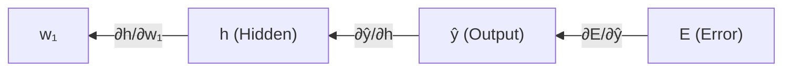
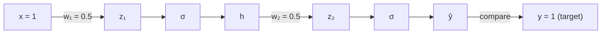

# Forward Propagation, Backpropagation & Weight Update

## 1. The Training Cycle

A single training step follows this loop:

## 2. Forward Propagation

Data flows **input → hidden layers → output**. Each layer computes:

$$
z = \sum x_i \cdot w_i + b
$$

then applies an activation function. The final layer produces the prediction $\hat{y}$.

## 3. Loss / Error

The difference between the predicted output ($\hat{y}$) and the actual expected output ($y$).

$$
E = f(\hat{y}, y)
$$

This single number tells the network **how wrong** it is.

## 4. Backpropagation (Chain Rule)

To fix the weights, we need to know: **how much does each weight contribute to the error?**

This is answered by $\frac{\partial E}{\partial w}$ — the derivative of the error with respect to each weight.

For weights **near the output**, this is straightforward. For weights **deep in the network**, we apply the **chain rule** through intermediate values:

$$
\frac{\partial E}{\partial w_1} = \frac{\partial E}{\partial \hat{y}} \cdot \frac{\partial \hat{y}}{\partial h} \cdot \frac{\partial h}{\partial w_1}
$$

> [!IMPORTANT]
> The chain goes through **intermediate values** (activations), NOT through other weights. Weights are independent of each other.

## 5. Weight Update (Gradient Descent)

$$
w^{\text{new}} = w^{\text{old}} - \eta \cdot \frac{\partial E}{\partial w}
$$

- $\eta$ = **learning rate** (controls step size)
- The **minus sign** means: move **opposite** to the gradient
  - Positive gradient → weight **decreases** (increasing it would increase error)
  - Negative gradient → weight **increases** (increasing it would decrease error)

> [!WARNING]
> The learning rate is a **global** multiplier — it applies equally to all weights across all layers. It cannot fix per-layer gradient issues.

## 6. Vanishing Gradient Problem

In deep networks, backpropagation chains many derivatives together via multiplication.

If each individual derivative is small (e.g., 0.1):

$$
0.1 \times 0.1 \times 0.1 \times 0.1 \times 0.1 = 10^{-5}
$$

The gradient **vanishes** for early layers. Consequences:
- **Earlier layers** (longest chains) barely learn
- **Later layers** (short chains) learn fine
- The network fails to learn fundamental features

## 7. Why the Step Function Fails in Deep Networks

The step function has a derivative of **zero everywhere** (flat on both sides of the step).

If any term in the chain rule product is 0, the entire gradient is 0:

$$
\frac{\partial E}{\partial w_1} = \frac{\partial E}{\partial \hat{y}} \cdot \underbrace{\frac{\partial \hat{y}}{\partial h}}_{= 0} \cdot \frac{\partial h}{\partial w_1} = 0
$$

The weights **never update**. This is why multi-layer networks need activation functions that are:
1. **Non-linear** — otherwise stacking layers collapses into a single linear function
2. **Differentiable** — so gradients can flow back
3. **Non-zero derivatives** — so gradients don't die

---

## 8. Worked Example — A Single Training Pass

A complete numerical walkthrough of forward prop → loss → backprop → weight update on a minimal network.

### Network Setup

- Biases: $b_1 = 0, \ b_2 = 0$ (omitted for clarity)
- Activation: Sigmoid $\sigma(z) = \frac{1}{1 + e^{-z}}$, with derivative $\sigma'(z) = \sigma(z)(1 - \sigma(z))$
- Loss: MSE $E = \frac{1}{2}(y - \hat{y})^2$
- Learning rate: $\eta = 0.5$

### Step 1 — Forward Propagation

**Hidden layer:**

$$
\begin{aligned}
z_1 &= w_1 \cdot x = 0.5 \times 1 = 0.5 \\
h &= \sigma(0.5) = \frac{1}{1 + e^{-0.5}} = \frac{1}{1.6065} = 0.6225
\end{aligned}
$$

**Output layer:**

$$
\begin{aligned}
z_2 &= w_2 \cdot h = 0.5 \times 0.6225 = 0.3112 \\
\hat{y} &= \sigma(0.3112) = \frac{1}{1 + e^{-0.3112}} = \frac{1}{1.7323} = 0.5772
\end{aligned}
$$

### Step 2 — Compute Loss

$$
E = \frac{1}{2}(y - \hat{y})^2 = \frac{1}{2}(1 - 0.5772)^2 = \frac{1}{2}(0.4228)^2 = 0.0894
$$

### Step 3 — Backpropagation

We compute every individual derivative in the chain, working **backwards** from the error.

**Loss → Output:**

$$
\frac{\partial E}{\partial \hat{y}} = -(y - \hat{y}) = -(0.4228) = -0.4228
$$

**Output activation:**

$$
\frac{\partial \hat{y}}{\partial z_2} = \sigma'(z_2) = \hat{y}(1 - \hat{y}) = 0.5772 \times 0.4228 = 0.2440
$$

**Output weight & hidden activation:**

$$
\frac{\partial z_2}{\partial w_2} = h = 0.6225 \qquad \frac{\partial z_2}{\partial h} = w_2 = 0.5
$$

**Hidden activation:**

$$
\frac{\partial h}{\partial z_1} = \sigma'(z_1) = h(1 - h) = 0.6225 \times 0.3775 = 0.2350
$$

**Hidden weight:**

$$
\frac{\partial z_1}{\partial w_1} = x = 1
$$

**Now chain them together:**

For $w_2$ (2 links in the chain):

$$
\frac{\partial E}{\partial w_2} = \frac{\partial E}{\partial \hat{y}} \cdot \frac{\partial \hat{y}}{\partial z_2} \cdot \frac{\partial z_2}{\partial w_2} = (-0.4228)(0.2440)(0.6225) = -0.0642
$$

For $w_1$ (4 links in the chain):

$$
\frac{\partial E}{\partial w_1} = \frac{\partial E}{\partial \hat{y}} \cdot \frac{\partial \hat{y}}{\partial z_2} \cdot \frac{\partial z_2}{\partial h} \cdot \frac{\partial h}{\partial z_1} \cdot \frac{\partial z_1}{\partial w_1} = (-0.4228)(0.2440)(0.5)(0.2350)(1) = -0.0121
$$

### Step 4 — Weight Update

$$
\begin{aligned}
w_2^{\text{new}} &= 0.5 - 0.5 \times (-0.0642) = 0.5 + 0.0321 = 0.5321 \\
w_1^{\text{new}} &= 0.5 - 0.5 \times (-0.0121) = 0.5 + 0.0061 = 0.5061
\end{aligned}
$$

### Key Observation — Vanishing Gradient in Action

| Weight | Gradient | Update Size |
|---|---|---|
| $w_2$ (near output) | -0.0642 | 0.0321 |
| $w_1$ (near input) | -0.0121 | 0.0061 |

$w_1$'s gradient is **~5× smaller** than $w_2$'s — and this is only a 2-layer network. In deeper networks, this ratio grows exponentially, starving earlier layers of learning signal.

> [!NOTE]
> Both gradients are negative, meaning both weights need to **increase** to reduce the error (minus × negative = increase). This makes sense intuitively — the network is underestimating the target ($\hat{y} = 0.58$ vs $y = 1$), so it needs stronger connections.

---

## Navigation
- [<- Back to Perceptron](01_Perceptron.md)
- [Forward to Activation Functions ->](03_Activation_Functions.md)
