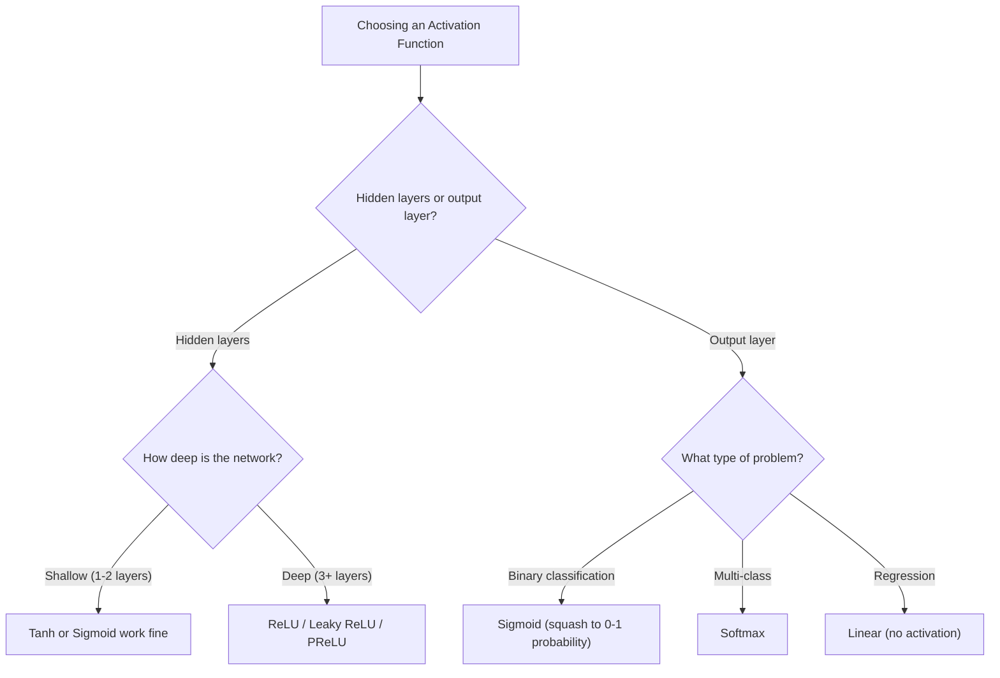

# Activation Functions — A Progressive Deep Dive

Each activation function was invented to fix a specific problem with the previous one. This note traces that evolution with numerical proofs.

## 1. Why We Need Activation Functions

From the perceptron discussion, a good activation function must be:

1. **Non-linear** — otherwise stacking layers collapses into a single linear function
2. **Differentiable** — so gradients can flow back during backpropagation
3. **Non-zero derivatives** — so gradients don't die

---

## 2. Step Function

$$
f(z) = \begin{cases} 1 & \text{if } z > 0 \\ 0 & \text{if } z \leq 0 \end{cases}
$$

**Derivative:** 0 everywhere (flat on both sides), undefined at $z = 0$.

### Numerical Example — Complete Gradient Death

Consider a 2-layer network with step activation:

**Forward pass:**
- $z_1 = 0.5 \times 1 = 0.5 \implies h = \text{step}(0.5) = 1$
- $z_2 = 0.5 \times 1 = 0.5 \implies \hat{y} = \text{step}(0.5) = 1$
- Target $y = 0$, Error $E = \frac{1}{2}(0 - 1)^2 = 0.5$

**Backprop:**

$$
\frac{\partial E}{\partial w_1} = \frac{\partial E}{\partial \hat{y}} \cdot \underbrace{\frac{\partial \hat{y}}{\partial z_2}}_{\text{step}'= 0} \cdot \frac{\partial z_2}{\partial h} \cdot \underbrace{\frac{\partial h}{\partial z_1}}_{\text{step}'= 0} \cdot \frac{\partial z_1}{\partial w_1} = 0
$$

**Result:** Gradient = 0. Error is 0.5, but weights **cannot update at all**. The network is stuck forever.

> [!CAUTION]
> ✅ Non-linear  
> ❌ Not differentiable  
> ❌ Zero derivative everywhere  
> **Verdict:** Useless for multi-layer networks.

---

## 3. Sigmoid

$$
\sigma(z) = \frac{1}{1 + e^{-z}}
$$

**Derivative:** $\sigma'(z) = \sigma(z)(1 - \sigma(z))$

**Output range:** (0, 1)

**Fixes from Step Function:** Smooth, differentiable, non-zero gradients.

### Problem 1 — Vanishing Gradient (max derivative = 0.25)

The derivative $\sigma(z)(1 - \sigma(z))$ is maximized when $\sigma(z) = 0.5$:

$$
0.5 \times (1 - 0.5) = 0.25
$$

**Numerical proof — 5-layer network, best case scenario:**

Even if every sigmoid neuron sits at the sweet spot ($z = 0$, derivative = 0.25):

$$
\text{gradient at layer 1} = 0.25^5 = 0.00098
$$

| Layer | Gradient multiplier | Cumulative |
|---|---|---|
| 5 (output) | 0.25 | 0.25 |
| 4 | 0.25 | 0.0625 |
| 3 | 0.25 | 0.0156 |
| 2 | 0.25 | 0.0039 |
| 1 (input) | 0.25 | **0.00098** |

Layer 1 gets less than **0.1%** of the gradient signal. In practice, most neurons are NOT at the sweet spot, so the actual derivatives are much smaller than 0.25 — making this even worse.

### Problem 2 — Not Zero-Centered (all outputs positive)

Since sigmoid outputs are always in (0, 1), all inputs to the next layer are **positive**.

For a neuron $z = w_1 x_1 + w_2 x_2 + b$:

$$
\frac{\partial E}{\partial w_i} = \frac{\partial E}{\partial z} \cdot x_i
$$

**Numerical example:**

Suppose $\frac{\partial E}{\partial z} = -2.0$ and inputs from sigmoid are $x_1 = 0.8$, $x_2 = 0.3$:

$$
\begin{aligned}
\frac{\partial E}{\partial w_1} &= (-2.0) \times (0.8) = -1.6 \quad \text{(negative)} \\
\frac{\partial E}{\partial w_2} &= (-2.0) \times (0.3) = -0.6 \quad \text{(negative)}
\end{aligned}
$$

Both gradients are **negative** because both $x_i$ are positive — they're forced to have the **same sign** as $\frac{\partial E}{\partial z}$.

**Consequence:** Both weights can only increase or both decrease. If the optimal solution needs $w_1 \uparrow$ and $w_2 \downarrow$, the optimizer must **zigzag** to get there, wasting many update steps.

> [!CAUTION]
> ✅ Non-linear  
> ✅ Differentiable  
> ⚠️ Max derivative only 0.25 → vanishing gradients  
> ❌ Not zero-centered → zigzag updates  
> **Verdict:** Works, but struggles in deep networks.

---

## 4. Tanh

$$
\tanh(z) = \frac{e^z - e^{-z}}{e^z + e^{-z}}
$$

**Derivative:** $\tanh'(z) = 1 - \tanh^2(z)$

**Output range:** (-1, 1)

**Fixes from Sigmoid:**
- **Zero-centered** outputs → no zigzag problem
- **Max derivative = 1** (at $z = 0$): $1 - 0^2 = 1$

### Fix Demonstrated — Zero-Centered Inputs

Same setup, but now with tanh outputs: $x_1 = 0.7$, $x_2 = -0.4$

$$
\begin{aligned}
\frac{\partial E}{\partial w_1} &= (-2.0) \times (0.7) = -1.4 \quad \text{(negative)} \\
\frac{\partial E}{\partial w_2} &= (-2.0) \times (-0.4) = +0.8 \quad \text{(positive)}
\end{aligned}
$$

Gradients have **different signs** → $w_1$ can increase while $w_2$ decreases → **direct path** to the optimum.

### Problem That Remains — Saturation at Extremes

At $z = 0$, derivative is great ($= 1$). But for large $|z|$:

| $z$ | $\tanh(z)$ | $\tanh'(z) = 1 - \tanh^2(z)$ |
|---|---|---|
| 0 | 0.000 | **1.000** |
| 1 | 0.762 | 0.420 |
| 2 | 0.964 | 0.071 |
| 3 | 0.995 | **0.010** |
| 5 | 0.9999 | **0.0002** |

At $z = 3$, the derivative has already dropped to **0.01**. In a 5-layer network with $z = 3$ at each layer:

$$
0.01^5 = 10^{-10}
$$

The gradient is **ten-billionths** of the original signal. Still vanishes for deep networks — just slower than sigmoid.

> [!CAUTION]
> ✅ Non-linear  
> ✅ Differentiable  
> ✅ Zero-centered  
> ✅ Max derivative = 1  
> ⚠️ Still saturates at extremes → vanishing gradients in deep networks  
> **Verdict:** Better than sigmoid, but still struggles when activations are large.

---

## 5. ReLU (Rectified Linear Unit)

$$
f(z) = \max(0, z) = \begin{cases} z & \text{if } z > 0 \\ 0 & \text{if } z \leq 0 \end{cases}
$$

**Derivative:**

$$
f'(z) = \begin{cases} 1 & \text{if } z > 0 \\ 0 & \text{if } z \leq 0 \end{cases}
$$

**Output range:** $[0, \infty)$

**Fixes from Tanh:**
- **No saturation for positive values** — derivative is always exactly 1, no matter how large $z$ is
- **Computationally simple** — just a comparison, no exponentials

### Fix Demonstrated — No Vanishing Gradient (for positive z)

5-layer network where all neurons have positive pre-activations:

$$
1 \times 1 \times 1 \times 1 \times 1 = 1
$$

**Perfect gradient flow.** Compare with sigmoid ($0.25^5 = 0.001$) and tanh at extremes ($0.01^5 = 10^{-10}$).

### Problem — Dying ReLU

When $z \leq 0$, the derivative is **exactly 0**. If a neuron's weighted sum becomes negative, it outputs 0 and gets zero gradient — it can never recover.

**Numerical example — a neuron gets stuck:**

Neuron with $w = -0.5$, $b = 0$, input $x = 2$:

$$
z = (-0.5)(2) + 0 = -1.0 \implies f(-1.0) = 0
$$

Gradient for this neuron:

$$
\frac{\partial E}{\partial w} = \frac{\partial E}{\partial z} \cdot \underbrace{f'(-1.0)}_{= 0} \cdot x = 0
$$

Weight update: $w_{\text{new}} = -0.5 - \eta \cdot 0 = -0.5$ (unchanged).

Next iteration, same input:
- $z = (-0.5)(2) = -1.0 \implies f(-1.0) = 0 \implies$ gradient = 0 again

The neuron is **permanently dead**. It outputs 0 for all inputs, receives 0 gradient, and never updates. This is called the **dying ReLU problem**.

> [!CAUTION]
> ✅ Non-linear  
> ✅ Derivative = 1 for positive inputs (no vanishing gradient!)  
> ✅ Computationally cheap  
> ❌ Dying ReLU — neurons with negative z are permanently dead  
> ❌ Not zero-centered (outputs are always ≥ 0)  
> **Verdict:** Excellent for most cases, but dead neurons waste network capacity.

---

## 6. Leaky ReLU / Parametric ReLU

$$
f(z) = \begin{cases} z & \text{if } z > 0 \\ \alpha z & \text{if } z \leq 0 \end{cases}
$$

where $\alpha$ is a small constant (typically 0.01 for Leaky ReLU) or a **learnable parameter** (PReLU).

**Derivative:**

$$
f'(z) = \begin{cases} 1 & \text{if } z > 0 \\ \alpha & \text{if } z \leq 0 \end{cases}
$$

**Output range:** $(-\infty, \infty)$

**Fixes from ReLU:** Neurons with negative $z$ still get a small gradient → they can recover.

### Fix Demonstrated — Dead Neuron Recovery

Same neuron: $w = -0.5$, $b = 0$, $x = 2$, $\alpha = 0.01$:

$$
z = (-0.5)(2) = -1.0 \implies f(-1.0) = 0.01 \times (-1.0) = -0.01
$$

Gradient:

$$
\frac{\partial E}{\partial w} = \frac{\partial E}{\partial z} \cdot \underbrace{f'(-1.0)}_{= 0.01} \cdot x = \frac{\partial E}{\partial z} \cdot 0.01 \cdot 2
$$

Suppose $\frac{\partial E}{\partial z} = -1.0$:

$$
\frac{\partial E}{\partial w} = (-1.0)(0.01)(2) = -0.02
$$

Weight update ($\eta = 0.5$):

$$
w_{\text{new}} = -0.5 - 0.5 \times (-0.02) = -0.5 + 0.01 = -0.49
$$

The gradient is small ($-0.02$ vs $-1.0$ for positive ReLU), but it's **not zero**. Over many iterations, the weight will gradually shift, and the neuron can **come back to life**.

| | ReLU | Leaky ReLU |
|---|---|---|
| $z = -1.0$ output | 0 | -0.01 |
| Derivative | 0 | 0.01 |
| Gradient | **0 (dead)** | **-0.02 (alive)** |
| Weight update | None | -0.49 (recovering) |

**Parametric ReLU (PReLU):** Instead of fixing $\alpha = 0.01$, make it a **learnable parameter** — the network learns the optimal slope for negative inputs, just like it learns weights.

> [!NOTE]
> ✅ Non-linear  
> ✅ Derivative = 1 for positive (no vanishing gradient)  
> ✅ Non-zero derivative for negative (no dying neurons)  
> ✅ Computationally cheap  
> **Verdict:** Fixes all major problems. Leaky ReLU / PReLU are strong default choices.

---

## 7. Summary Comparison

| Function | Formula | Derivative | Range | Max Derivative | Key Problem |
|---|---|---|---|---|---|
| Step | $\begin{cases} 0/1 \end{cases}$ | 0 everywhere | {0, 1} | 0 | No gradient at all |
| Sigmoid | $\frac{1}{1+e^{-z}}$ | $\sigma(1-\sigma)$ | (0, 1) | 0.25 | Vanishing gradient + not zero-centered |
| Tanh | $\frac{e^z-e^{-z}}{e^z+e^{-z}}$ | $1-\tanh^2$ | (-1, 1) | 1.0 | Saturates at extremes |
| ReLU | $\max(0,z)$ | 0 or 1 | $[0, \infty)$ | 1.0 | Dying neurons |
| Leaky ReLU | $\max(\alpha z, z)$ | $\alpha$ or 1 | $(-\infty, \infty)$ | 1.0 | $\alpha$ is a hyperparameter |
| PReLU | $\max(\alpha z, z)$ | $\alpha$ or 1 | $(-\infty, \infty)$ | 1.0 | Slightly more parameters to learn |

## 8. When to Use What

> [!TIP]
> **Default choice for hidden layers:** Start with ReLU. If you notice many dead neurons during training (outputs stuck at 0), switch to Leaky ReLU or PReLU.

---

## Navigation
- [<- Back to Forward/Backward Propagation](02_Forward_Backward_Propagation.md)
- [Forward to Loss Functions ->](04_Loss_Functions.md)
