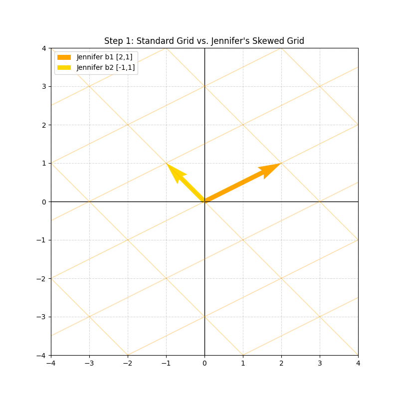
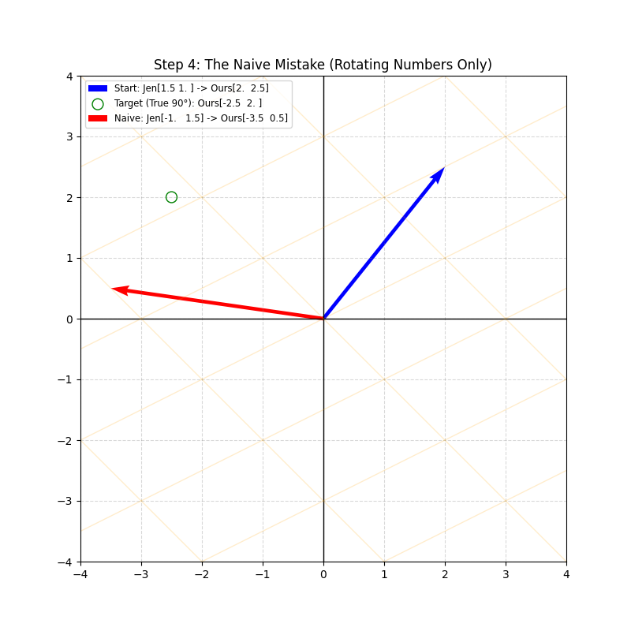
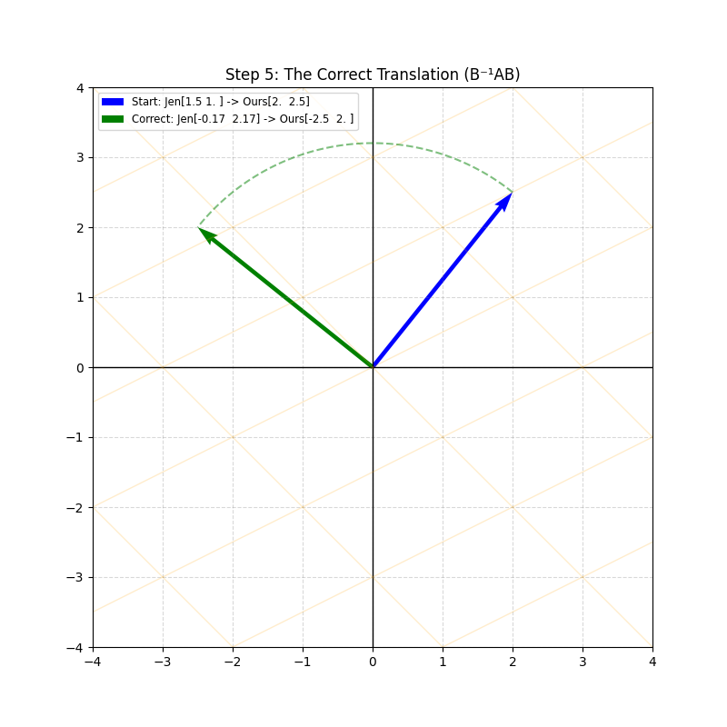

# Chapter 3: Change of Basis

## 1. Intuition: The "Translation" Analogy

Think of a linear transformation (like a 90-degree rotation) as a **concept**, like "turning left."
- We speak **Language A** (the Standard Basis).
- Jennifer speaks **Language B** (her own basis vectors, which might be tilted or stretched).

### The Coordinate System Mismatch
Jennifer's grid is not like ours. When she says "go 1 unit right," she moves along her own basis vector $\vec{b}_1$. To us, that might look like a diagonal move.

Because her "space" is distorted relative to ours, simply applying our rotation matrix to her coordinate numbers doesn't work.

---

## 2. The Mistake: "Naive" Rotation

The most common mistake is to treat Jennifer's coordinates as if they were standard coordinates. 

If Jennifer has a vector at $[1.5, 1]$ and we want to rotate it 90°, we might "naively" swap the numbers using our standard rotation matrix $A$:

$$ \begin{bmatrix} 0 & -1 \\ 1 & 0 \end{bmatrix} \begin{bmatrix} 1.5 \\ 1 \end{bmatrix} = \begin{bmatrix} -1 \\ 1.5 \end{bmatrix} $$

**Why this fails:**
In our square grid, $[-1, 1.5]$ results in a 90° turn. But in Jennifer's **skewed grid**, these coordinates land in a completely different physical direction. If we translate this "Naive" result back to our world, we see it lands at:

$$ B \begin{bmatrix} -1 \\ 1.5 \end{bmatrix} = \begin{bmatrix} 2 & -1 \\ 1 & 1 \end{bmatrix} \begin{bmatrix} -1 \\ 1.5 \end{bmatrix} = \begin{bmatrix} -3.5 \\ 0.5 \end{bmatrix} $$

*Notice how the red "Naive" vector completely misses the physical 90-degree target circle (green).*

---

## 3. The Solution: The Three-Step Translation

To perform a 90-degree rotation in **her** world correctly, we must jump between "languages" using matrix multiplication:

1.  **Translate to Our Language ($B$):**
    $$ \vec{v}_{Ours} = B \vec{v}_{Jen} = \begin{bmatrix} 2 & -1 \\ 1 & 1 \end{bmatrix} \begin{bmatrix} 1.5 \\ 1 \end{bmatrix} = \begin{bmatrix} 2 \\ 2.5 \end{bmatrix} $$
2.  **Apply the Concept ($A_{Ours}$):**
    $$ \vec{v}'_{Ours} = A_{Ours} \vec{v}_{Ours} = \begin{bmatrix} 0 & -1 \\ 1 & 0 \end{bmatrix} \begin{bmatrix} 2 \\ 2.5 \end{bmatrix} = \begin{bmatrix} -2.5 \\ 2 \end{bmatrix} $$
3.  **Translate Back ($B^{-1}$):**
    $$ \vec{v}_{Jen\_Correct} = B^{-1} \vec{v}'_{Ours} = \frac{1}{3} \begin{bmatrix} 1 & 1 \\ -1 & 2 \end{bmatrix} \begin{bmatrix} -2.5 \\ 2 \end{bmatrix} \approx \begin{bmatrix} -0.17 \\ 2.17 \end{bmatrix} $$

### The Result: Success
By using this "sandwich" of matrices, we ensure the physical action is preserved, even though the coordinates Jennifer uses are completely different from ours.

---

## 4. Mathematical Formulation: Similarity Transformation

This process is captured by the formula:

$$ A_{Jennifer} = B^{-1} A_{Ours} B $$

Where:
* **$B$ (The "To-Ours" Matrix):** Its columns are Jennifer's basis vectors. It translates "Jennifer-speak" to "Our-speak."
* **$A_{Ours}$:** The transformation as we understand it (e.g., the 90° rotation matrix).
* **$B^{-1}$ (The "To-Jennifer" Matrix):** Translates our results back into her language.

This pattern is known as a **Similarity Transformation**.

---

## 5. ML Connection

* **Principal Component Analysis (PCA):** PCA is a Change of Basis where the new axes align with the data's variance.
* **Diagonalization:** If we choose a basis of **eigenvectors**, the transformation becomes a simple scaling along those axes ($B^{-1}AB = D$). This makes complex operations like matrix exponentiation very simple.

---

[Previous Chapter](./02-Cross-Products.md) | [Next Chapter](./04-Eigenvectors-and-Eigenvalues.md)
