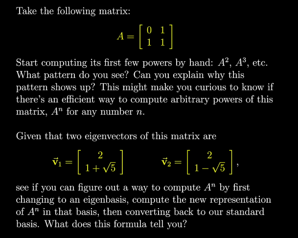

# Chapter 5: Eigenbasis and Diagonalization

## 1. Intuition: The "Cheat Code" Coordinate System

Imagine you are playing a video game where your character moves diagonally whenever you press "Right." That would be annoying to program. You would rather rotate the camera so that "Right" actually moves the character along the path they are meant to follow.

An **Eigenbasis** is exactly that: it is a change of basis where you choose the **eigenvectors** of a transformation as your new basis vectors.

*   **Standard Basis:** The transformation looks messy (e.g., $x$ and $y$ are mixed together).
*   **Eigenbasis:** The transformation is **diagonal**. Every axis only stretches or squashes. There is no rotation or shearing to worry about.

In an Eigenbasis, the dimensions are **decoupled**. What happens to one axis does not affect the others.

---

## 2. The "Why": Connecting to Chapter 3

In Chapter 3, we used a "translation sandwich" to see how our transformation looked in Jennifer's coordinates:
$$ A_{Jennifer} = B^{-1} A_{Ours} B $$

**Diagonalization is the reverse search.** We have a messy transformation $A$, and we are searching for a special coordinate system (the **Eigenbasis**) where that transformation becomes a simple diagonal matrix $D$. 

If such a basis $P$ exists, then in that basis, the transformation is:
$$ D = P^{-1} A P $$
Rearranging this gives us the standard diagonalization formula:
$$ A = P D P^{-1} $$

### The Mathematical Proof
Why must $P$ consist of eigenvectors? Let's look at the matrix equation $AP = PD$.

If $P = [\vec{v}_1 \quad \vec{v}_2 \quad \dots \quad \vec{v}_n]$, then:
1.  **Left Side ($AP$):** Applying the transformation to the columns of $P$:
    $$ A[\vec{v}_1 \quad \vec{v}_2] = [A\vec{v}_1 \quad A\vec{v}_2] $$
2.  **Right Side ($PD$):** Scaling the columns of $P$ by the diagonal values $\lambda$:
    $$ [\vec{v}_1 \quad \vec{v}_2] \begin{bmatrix} \lambda_1 & 0 \\ 0 & \lambda_2 \end{bmatrix} = [\lambda_1\vec{v}_1 \quad \lambda_2\vec{v}_2] $$

For $AP = PD$ to be true, it **must** be that $A\vec{v}_i = \lambda_i\vec{v}_i$. This is the exact definition of an eigenvector! 

**Summary:** Diagonalization is only possible if you use the eigenvectors as your new basis vectors. If you do, the transformation "decouples" and becomes a simple list of scaling factors.

> 💡 **Deep Dive:** [The Mechanics of Diagonalization](./sidenotes/Diagonalization-Deep-Dive.md)
> Want to see how this is used to predict the future (Markov Chains) or how it acts like an "Audio Equalizer" for math? Check out this deep dive for real-world examples and the complete mathematical proofs.

---

## 3. Example: $A = \begin{bmatrix} 3 & 1 \\ 0 & 2 \end{bmatrix}$

From Chapter 4, we have:
*   $\lambda_1 = 3 \implies \vec{v}_1 = \begin{bmatrix} 1 \\ 0 \end{bmatrix}$
*   $\lambda_2 = 2 \implies \vec{v}_2 = \begin{bmatrix} 1 \\ -1 \end{bmatrix}$

We construct $P$ and $D$:
$$ P = \begin{bmatrix} 1 & 1 \\ 0 & -1 \end{bmatrix}, \quad D = \begin{bmatrix} 3 & 0 \\ 0 & 2 \end{bmatrix} $$

In the coordinate system defined by $P$, the transformation $A$ is simply $D$. It has no "interaction" between the axes.

---

## 4. Why it Matters: The Power of $A^n$

Calculating high powers of a matrix is common in Markov Chains and Neural Network stability analysis. Without diagonalization, $A^{100}$ requires 99 matrix multiplications. With an Eigenbasis:

$$ A^{100} = P D^{100} P^{-1} $$

Since $D$ is diagonal, $D^{100}$ is computed simply by raising each eigenvalue to the 100th power. This is a massive computational speedup.

---

## 5. ML Connection

*   **Principal Component Analysis (PCA):** PCA is essentially the search for an Eigenbasis where the data's features are **uncorrelated**. In this new basis, the covariance matrix is diagonal.
*   **Spectral Clustering:** We use the Eigenbasis of a graph's Laplacian matrix to find clusters. The eigenvectors provide coordinates that make grouping data points much easier.
*   **Stability of RNNs:** We analyze the eigenvalues of the weight matrices to ensure that information doesn't disappear (Vanishing Gradient) or explode (Exploding Gradient) as it passes through many time steps.

---

## 6. Failure Modes: Non-Diagonalizable Matrices

A matrix can only be diagonalized if it has enough linearly independent eigenvectors to form a full basis ($n$ vectors for an $n \times n$ matrix).
*   **Defective Matrices:** Matrices like a **Shear** $\begin{bmatrix} 1 & 1 \\ 0 & 1 \end{bmatrix}$ only have one unique eigenvector. You cannot form a basis with them, meaning they **cannot be diagonalized**.

---

## 7. The Eigen Puzzle: The Fibonacci Matrix

Here is a practical puzzle that perfectly demonstrates the power of diagonalization:

This puzzle asks you to compute the powers of $A = \begin{bmatrix} 0 & 1 \\ 1 & 1 \end{bmatrix}$ and use its eigenbasis to find a closed-form formula for its powers.

> 🧩 **Solve the Puzzle:** Once you've given it a try, check out the [Solution to the Eigen-Puzzle](./sidenotes/Eigen-Puzzle-Solution.md) to see how diagonalization leads directly to one of the most famous formulas in mathematics—and mathematically proves its connection to the Golden Ratio!

---

[Previous Chapter](./04-Eigenvectors-and-Eigenvalues.md)

