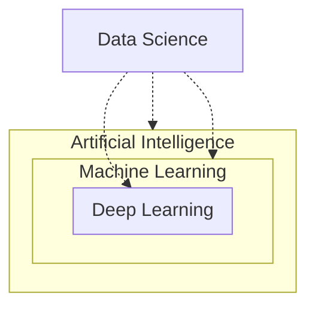
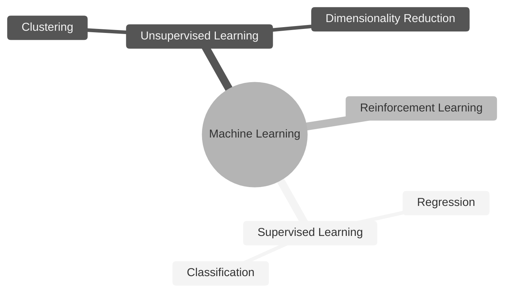
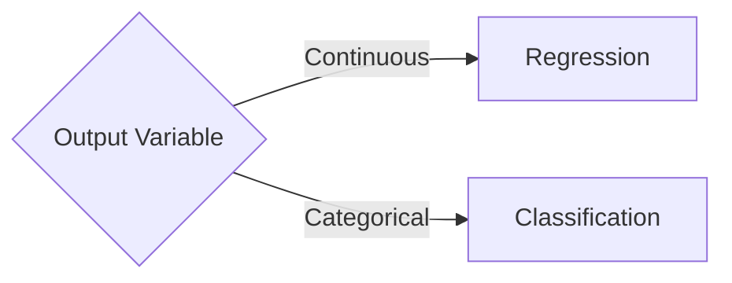
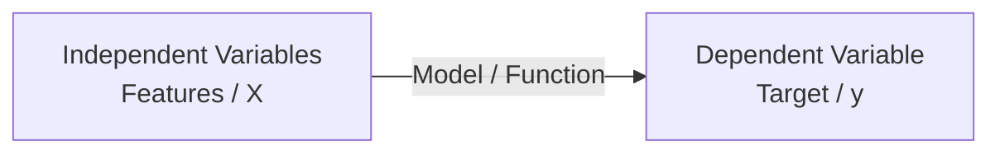
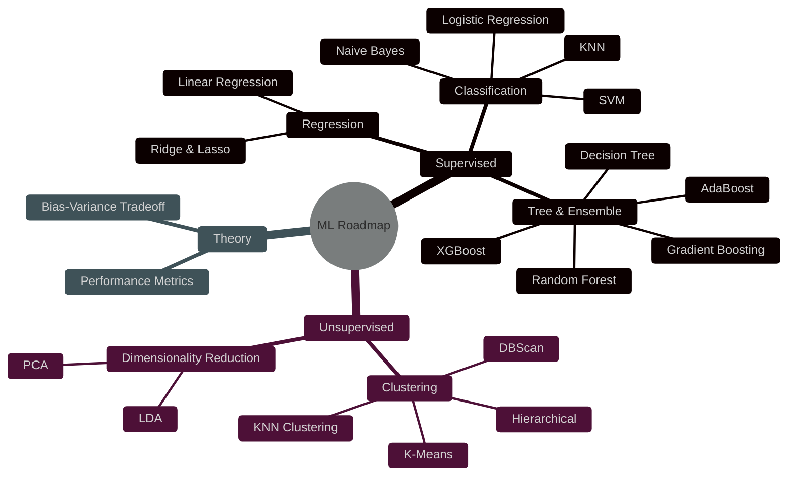

# Chapter 1: Foundations of AI, ML, and DL

This chapter covers the basic definitions and the relationship between Artificial Intelligence, Machine Learning, Deep Learning, and Data Science, as well as the fundamental split between Regression and Classification.

## 1. AI vs ML vs DL vs Data Science

Understanding the hierarchy and overlap of these fields is crucial for navigating the AI landscape.

### The Hierarchy (Venn Diagram)

| Field | Definition |
| :--- | :--- |
| **Artificial Intelligence (AI)** | The broad field of creating intelligent machines that can simulate human behavior and decision-making. |
| **Machine Learning (ML)** | A subset of AI that provides systems the ability to automatically learn and improve from experience without being explicitly programmed. |
| **Deep Learning (DL)** | A subset of ML based on artificial neural networks with multiple layers (hence "deep"). It excels at processing unstructured data like images and text. |
| **Data Science (DS)** | An interdisciplinary field that uses scientific methods, processes, algorithms, and systems to extract knowledge and insights from structured and unstructured data. |

---

## 2. Machine Learning Overview

Machine Learning is generally categorized based on how the algorithm learns.

### Supervised vs. Unsupervised Learning (Brief)
- **Supervised:** Learning with labeled data (Input -> Output).
- **Unsupervised:** Learning patterns from unlabeled data (Finding structure).

---

## 3. Regression vs. Classification

In Supervised Learning, the most fundamental split is based on the type of output variable.

### Regression
Used when the target variable is **continuous** (numerical).
- **Goal:** Predict a specific value.
- **Examples:** Predicting house prices, stock prices, or temperature.

### Classification
Used when the target variable is **categorical** (discrete).
- **Goal:** Predict a category or class.
- **Examples:** Spam vs. Not Spam, Cat vs. Dog, or Credit Risk (High/Low).

---

## 4. Features vs. Targets (Variables)

In Supervised Learning, we work with two main types of variables. Understanding this relationship is the key to building any model.

### Independent Variables (Features / $X$)
- **What they are:** The input data or variables that are used to make predictions.
- **Symbol:** Usually represented as uppercase **$X$**.

### Dependent Variable (Target / Label / $y$)
- **What it is:** The output or the variable we are trying to predict.
- **Symbol:** Usually represented as lowercase **$y$**.

### The Supervised Learning Equation
At its simplest level, machine learning is about finding the function $f$ that maps $X$ to $y$:

$$y = f(X)$$

---

## 5. Learning Roadmap

This roadmap follows the specific curriculum outlined in the crash course.

### Visual Hierarchy

### Topic Breakdown

| Category | Topics / Algorithms | Goal |
| :--- | :--- | :--- |
| **Supervised** | Linear Regression, Ridge & Lasso | Predict continuous values |
| **Supervised** | Logistic Reg, SVM, Naive Bayes, KNN | Predict discrete classes |
| **Ensemble** | Decision Tree, Random Forest, AdaBoost, Gradient Boosting, XGBoost | Improved predictive performance |
| **Unsupervised** | K-Means, DBScan, Hierarchical, KNN Clustering | Find patterns / clusters |
| **Dim. Reduction** | PCA, LDA | Reduce feature space |
| **Theory** | Bias-Variance, Metrics | Evaluation and Optimization |

---

## Navigation
- [<- Back to Main Index](../README.md)
- [Forward to Chapter 2: Supervised Learning](c2-supervised-learning.md)
