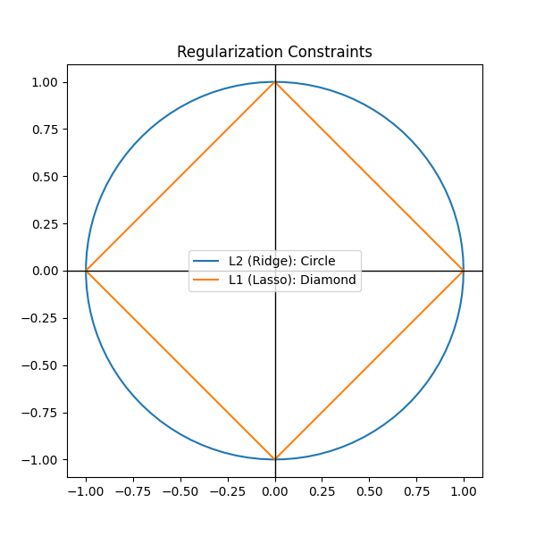
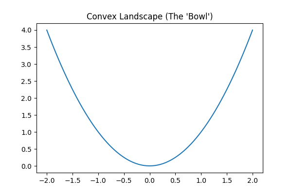
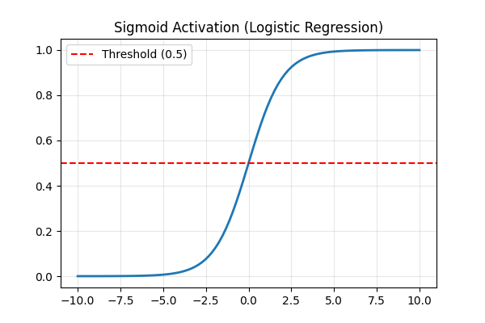

# Milestone Quiz 1: The Foundations of Supervised Learning

This quiz covers the exact topics and scenarios we discussed in the foundations chapter. **Try to answer the questions mentally first before checking the answer key.**

---

## Part 1: Initial Intuition

### Q1: The "Square Footage" Bully (KNN Scaling)
You are running a **KNN** model with two features: **Square Footage** (500 to 5,000) and **Number of Bathrooms** (1 to 5). If you forget to perform **Feature Scaling**, which feature will the KNN model essentially ignore? Why?

### Q2: The "Small Data" Student (Bias/Variance)
Why might a "simple" model like Naive Bayes beat a complex Neural Network when you only have **20 rows** of data? Use the terms **Overfitting** or **Variance** in your answer.

### Q3: The "Zero" Mystery (Lasso)
Mathematically, what does **Lasso (L1)** do to "useless" features that **Ridge (L2)** cannot do? Why does the "shape" of the regularization constraint matter?

### Q4: The "Hurricane" Problem (Zero Frequency)
If your Naive Bayes model sees a word in the test data that **never appeared** in our training data (e.g., "Hurricane"), what happens to the final probability? What is the name of the "Smoothing" technique used to fix it?

### Q5: The "Shape" of the Problem (Convexity)
In Linear Regression, the cost function (MSE) is a smooth "Bowl" (Convex). Why don't we use that same MSE "Bowl" for **Logistic Regression**?

---

## Part 2: Deep Dives

### Q6: The "Speed Trap" (Logistic Scaling)
Even though the Sigmoid scales the *output* to 0-1, why does Logistic Regression still train much faster if we scale the **input** features (like Salary vs. Age)?

### Q7: The "Generative" Identity
If you wanted to build an AI that could **generate** a fake picture of a cat rather than just classify one, would you use **Logistic Regression** or **Naive Bayes**? Why?

### Q8: The Cancer Threshold
You are building a **Cancer Detector**. Would you want to **lower** the threshold (e.g., to 0.1) or **raise** it? What is the real-world consequence?

### Q9: The "Billionaire" Outlier
One house in your dataset costs **$100 Billion**. If $K=1$, which model is more "devastated" by this outlier: **KNN** or **Logistic Regression**? Why?

### Q10: The "Hong Kong" Dependency
Naive Bayes assumes features are independent. Give an example (like "Hong Kong") of how this "lie" can lead to the model being **overconfident**.

### Q11: The "Lazy" Tax
KNN has a training complexity of $O(1)$ and a prediction complexity of $O(n \cdot d)$. Why is it called a **Lazy Learner**, and where is this a deal-breaker?

---

## Answer Key & Explanations

Click to see answers and visualizations

### 1. KNN Scaling
It ignores **Bathrooms**. KNN calculates distance. $5000^2$ (Square Footage) is so much larger than $5^2$ (Bathrooms) that the bathrooms become mathematically invisible.

### 2. Small Data
Simple models have **High Bias** (stubborn rules) but **Low Variance**. They don't "overfit" to the noise in tiny datasets, whereas complex models try to find "fake" patterns in the 20 rows.

### 3. Lasso vs. Ridge
Lasso can set weights to **exactly zero**, effectively deleting the feature. 

*As seen above, the **Lasso Diamond** has corners on the axes. A growing error bubble is much more likely to hit a corner (killing a weight) than the smooth side of the **Ridge Circle**.*

### 4. Zero Frequency
The probability becomes **Zero**. We use **Laplace Smoothing** (+1 to all counts) to ensure no single word can wipe out the entire prediction.

### 5. Convexity

*MSE + Sigmoid creates a "Non-Convex" landscape with many local minima. As seen in the "Bowl" above, Gradient Descent needs a smooth, single-valley surface to find the global minimum. **Log Loss** provides that smooth bowl.*

### 6. Logistic Scaling
Unscaled features create a long, narrow "canyon" in the cost landscape. Scaling makes the bowl rounder, allowing Gradient Descent to go straight to the bottom instead of "bouncing" off the canyon walls.

### 7. Generative Models
**Naive Bayes.** It learns the "Profile" of the data ($P(X|C)$). You can use this profile to sample new data. Logistic only learns the separator (Discriminative).

### 8. Cancer Threshold
**Lower it.** We'd rather have a False Alarm than miss a single case of cancer.

*Moving the threshold left (e.g., to 0.1) catches more potential cases but increases the number of healthy people flagged for more tests.*

### 9. Outliers
**KNN.** $K=1$ will predict whatever the nearest neighbor is, even if it's a crazy outlier. Logistic uses the "average" weight of the whole dataset, so the outlier's influence is diluted.

### 10. Overconfidence
**Hong Kong.** The model treats them as two separate pieces of evidence, double-counting the information. This makes the probability score much higher (closer to 1 or 0) than it should be.

### 11. Lazy Tax
It does no work until you ask for a prediction. This is a deal-breaker for **Real-time/High-frequency** tasks where every millisecond counts.

---

## Navigation
- [<- Back to Main Index](../README.md)
- [^ Back to Chapter 2 Index](c2-supervised-learning.md)