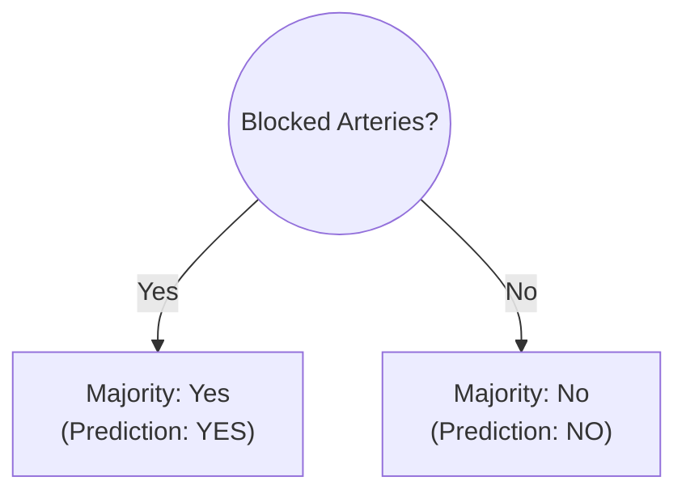
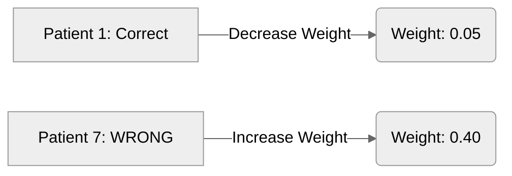
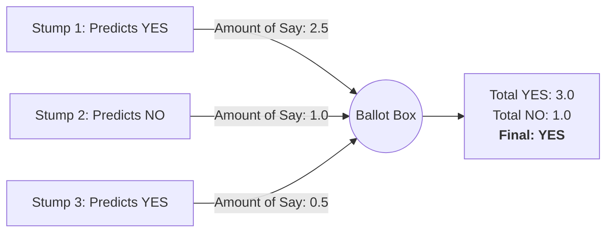

# 2.3.5 AdaBoost (Adaptive Boosting)

While Random Forest builds many deep, independent trees (Bagging), **AdaBoost** builds a sequence of very shallow, highly focused trees (Boosting).

> 🎥 **Quick Refresher:** [AdaBoost, Clearly Explained](https://www.youtube.com/watch?v=LsK-xG1cLYA) by StatQuest.

It is a sequential "Team of Specialists" where each new model is hired specifically to fix the mistakes of the previous one.

---

## 1. The "Weak Learner" (Decision Stumps)
AdaBoost rarely uses full Decision Trees. Instead, it uses **Decision Stumps**. 
A stump is a tree with exactly one node and two leaves. It asks **one question** and immediately makes a prediction based on the majority.

Because a stump only looks at one feature, it is a **Weak Learner**. It will inevitably get some predictions wrong.

---

## 2. The Four Steps of AdaBoost

Imagine we have a dataset of 8 patients, trying to predict Heart Disease.

### Step 1: Initializing Weights (The "Equal Start")
At the very beginning, the AI treats every patient equally.
- If there are 8 patients, every patient is assigned a weight of **$1/8$ ($0.125$)**.

The AI tests all possible stumps (e.g., Chest Pain, Blocked Arteries, Weight) and picks the one with the lowest **Weighted Gini Impurity**.

---

### Step 2: The "Amount of Say" ($\alpha$)
Let's say the winning stump (Stump #1) makes a prediction for all 8 patients, but it gets **2 patients wrong**.

We need to decide how much "Power" (Amount of Say) this stump gets in the final vote.
- **Total Error:** The sum of the weights of the misclassified patients (e.g., $0.125 + 0.125 = 0.25$).
- **Amount of Say ($\alpha$):** The AI uses a formula to assign a score.
  $$\alpha = \frac{1}{2} \ln \left( \frac{1 - \text{Total Error}}{\text{Total Error}} \right)$$
  - *If it's very accurate, $\alpha$ is a large positive number.*
  - *If it's 50/50 (a coin flip), $\alpha$ is 0.*

---

### Step 3: Updating the Weights (The "Adaptive" Shift)
This is the heart of AdaBoost. Before we build Stump #2, we change the importance of the patients.

1.  **For the patients we got RIGHT:** We **DECREASE** their weight. They are easy; we don't need to focus on them.
2.  **For the patients we got WRONG:** We **INCREASE** their weight. They become "Heavy."

**The Consequence:** When the AI builds **Stump #2**, it is mathematically forced to find a question that gets Patient 7 right, because Patient 7's massive weight dominates the new Gini Impurity calculation.

---

### Step 4: The Final Vote
The AI repeats this process until it has built hundreds of stumps (or until the error reaches zero).
To make a final prediction on a new patient, the AI doesn't just take a simple majority vote. It takes a **Weighted Vote**.

> **Example Walkthrough:** See the exact math and weight updates in the [AdaBoost Heart Disease Walkthrough](sample-application-adaboost.md).

---

*Even if 10 weak stumps predict "NO", a single highly accurate stump with a massive Amount of Say can overrule them.*

---

## 3. Pros and Cons

### Pros:
- **High Accuracy:** It turns weak rules of thumb into an incredibly strong predictor.
- **Resistant to Overfitting:** The sequential nature tends to generalize well on test data.

### Cons:
- **Sensitive to Noisy Data:** If an outlier is fundamentally mislabeled, AdaBoost will increase its weight endlessly, obsessing over a mistake it can never fix.
- **Slow Training:** Because it is sequential (Stump 2 *must* wait for Stump 1 to finish), it cannot be easily parallelized like a Random Forest.

---

## Navigation
- [<- Back to Random Forest](random-forest.md)
- [^ Back to Chapter 2 Index](../c2-supervised-learning.md)
- [2.3.6 Gradient Boosting (GBM) ->](gradient-boosting.md)
