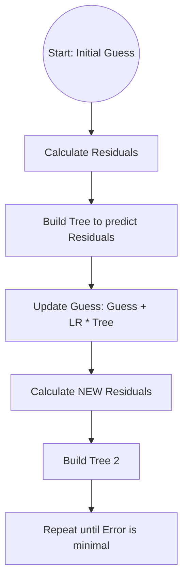

# 2.3.6 Gradient Boosting (GBM)

While AdaBoost fixes mistakes by increasing **Weights**, Gradient Boosting fixes mistakes by predicting the **Residuals** (the errors) of the previous model.

---

## 1. The Core Philosophy: "The Chisel"
Gradient Boosting is an iterative process. It starts with a very simple guess and then uses hundreds of small "Specialist" trees to shave down the error.

### The 4 Pillars
1.  **The Base Learner:** Usually a Decision Tree (Depth 3-6) rather than a stump. This allows the model to learn **Feature Interactions** (e.g., "Age matters *if* you also have Chest Pain").
2.  **The Loss Function:** A mathematical way to measure "how wrong we are" (Mean Squared Error for numbers, Log-Loss for classes).
3.  **The Residuals:** The actual values minus our current predictions.
4.  **The Learning Rate ($\eta$):** A multiplier (usually 0.1) that shrinks the contribution of each tree to prevent **Overfitting**.

---

## 2. The Logic Flow

> **Manual Trace:** See the exhaustive step-by-step math for both Regression and Classification in the [Gradient Boosting Walkthrough](sample-application-gradient-boosting.md).

---

## 3. The "Gradient" in the Name
In calculus, the **Gradient** is the slope of a curve.
In this algorithm, the **Residuals** we predict are actually the **Negative Gradient** of the Loss Function. By predicting residuals, we are literally walking down the slope of an "Error Bowl" until we find the minimum error.

---

## 4. XGBoost: The "Extreme" Version
XGBoost is a specific implementation of Gradient Boosting that is the "gold standard" in data science competitions. It adds:
- **Regularization:** Penalizes trees that are too complex.
- **Pruning:** Removes branches that don't help much.
- **Hardware Optimization:** Trains significantly faster than standard GBM.

---

## Navigation
- [<- Back to AdaBoost](adaboost.md)
- [^ Back to Chapter 2 Index](../c2-supervised-learning.md)
- [Gradient Boosting Walkthrough (Math & Tables) ->](sample-application-gradient-boosting.md)
- [2.3.7 The Big Three (XGBoost, LightGBM, CatBoost) ->](xgboost-lightgbm-catboost.md)
