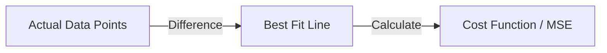
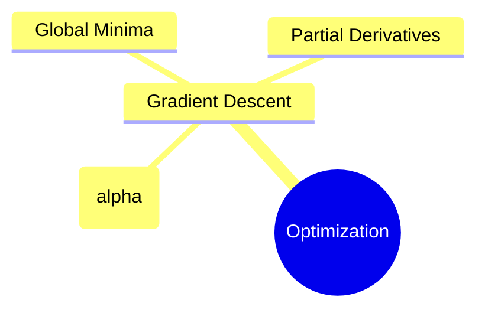
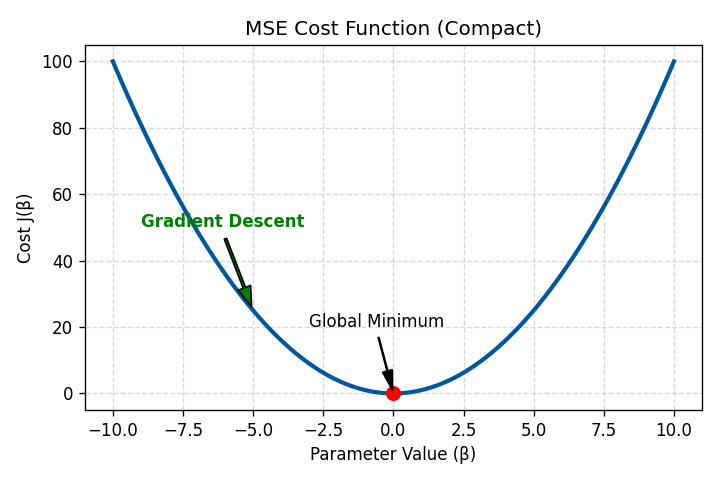

# 2.1.1 Linear Regression

Linear Regression is a fundamental supervised learning algorithm used for predicting a continuous numerical value (Regression). It assumes a linear relationship between the independent variables ($X$) and the dependent variable ($y$).

---

## 1. The Core Concept
The goal of linear regression is to find the "best-fit line" that minimizes the distance between the actual data points and the predicted values on the line.

### Mathematical Representation (Simple Linear Regression)
$$y = \beta_0 + \beta_1 X + \epsilon$$

| Term | Meaning |
| :--- | :--- |
| $y$ | Dependent Variable (Target) |
| $X$ | Independent Variable (Feature) |
| $\beta_0$ | Intercept (Where the line hits the y-axis) |
| $\beta_1$ | Coefficient / Slope (The weight of the feature) |
| $\epsilon$ | Error term (Residuals) |

---

## 2. Assumptions of Linear Regression

Before we trust our model, we must ensure the data follows these 5 core assumptions. If these are violated, the model's predictions might be technically "correct" but the statistical inferences (the "why") will be unreliable.

### 1. Linearity
- **The Rule:** There must be a linear relationship between the features ($X$) and the target ($y$).
- **The Intuition:** If your data follows a curve (like a parabola), trying to fit a straight line is like trying to put a square peg in a round hole.

### 2. Homoscedasticity (Constant Variance)
- **The Rule:** The variance of the error terms (residuals) should be constant across all levels of the independent variables.
- **The Intuition:** If the "spread" of your data points gets wider as $X$ increases (forming a "cone" shape), the model will be more certain about some predictions than others, which is a sign of instability.

### 3. Independence of Errors
- **The Rule:** The residuals should be independent of each other (no autocorrelation).
- **The Intuition:** This is especially important in time-series data. Today's error shouldn't be influenced by yesterday's error.

### 4. Normality of Residuals
- **The Rule:** For any fixed value of $X$, the residuals should follow a **Normal Distribution**.
- **The Intuition:** This ensures that the errors are random and not biased towards one direction. We check this using **Q-Q Plots**.

### 5. No Multicollinearity
- **The Rule:** The independent variables should not be highly correlated with each other.
- **The Intuition:** If $X_1$ and $X_2$ are basically the same thing (e.g., Height in inches vs. Height in cm), the model won't know which one to give the "credit" to. This messes up the weights ($\beta$).

---

## 3. Cost Function: Mean Squared Error (MSE)
To find the best line, we need to minimize the error. We use the **Cost Function** to measure how far off our predictions are.

$$MSE = \frac{1}{m} \sum_{i=1}^{m} (y_i - \hat{y}_i)^2$$
> [!TIP]
> ### Mathematical Sidenote: Why $\frac{1}{2m}$?
> In many textbooks and tutorials (like this video), you'll see the cost function defined with $\frac{1}{2m}$ instead of $\frac{1}{m}$. 
> 
> **The Reason:** It's for **Calculus convenience**. When we take the derivative of the squared error $(y - \hat{y})^2$ during Gradient Descent, the power rule brings the $2$ down. The $1/2$ is placed there specifically to **cancel out** that $2$, making the resulting gradient update formula cleaner:
> $$\frac{\partial}{\partial \beta} \frac{1}{2m}(y - \hat{y})^2 = \frac{1}{\cancel{2}m} \cdot \cancel{2} (y - \hat{y}) \cdot \frac{\partial}{\partial \beta}(y - \hat{y})$$
> Since $1/2$ is a constant, it doesn't change the location of the minimum point (the Global Minima).

---

## 4. Optimization: Gradient Descent
Gradient Descent is the algorithm used to update $\beta_0$ and $\beta_1$ to reach the minimum point of the cost function (Global Minima).

---

## 5. Mathematical Derivation: Minimizing the Cost Function

To minimize the Cost Function $J(\beta_0, \beta_1)$, we use **Partial Derivatives** to find the gradient (slope) at any given point and move in the opposite direction.

### Step 1: The Cost Function
Using the $\frac{1}{2m}$ convention for easier derivation:
$$J(\beta_0, \beta_1) = \frac{1}{2m} \sum_{i=1}^{m} (h_\beta(x^{(i)}) - y^{(i)})^2$$
Where $h_\beta(x) = \beta_0 + \beta_1 x$.

### Step 2: Deriving with respect to $\beta_0$ (Intercept)
We apply the chain rule:
$$\frac{\partial J}{\partial \beta_0} = \frac{\partial}{\partial \beta_0} \left[ \frac{1}{2m} \sum_{i=1}^{m} (\beta_0 + \beta_1 x^{(i)} - y^{(i)})^2 \right]$$

1. Pull out the constant and move the derivative inside the summation:
$$\frac{\partial J}{\partial \beta_0} = \frac{1}{2m} \sum_{i=1}^{m} \frac{\partial}{\partial \beta_0} (\beta_0 + \beta_1 x^{(i)} - y^{(i)})^2$$

2. Apply the power rule (the $2$ comes down and cancels with $1/2$):
$$\frac{\partial J}{\partial \beta_0} = \frac{1}{\cancel{2}m} \sum_{i=1}^{m} \cancel{2} (\beta_0 + \beta_1 x^{(i)} - y^{(i)}) \cdot \frac{\partial}{\partial \beta_0} (\beta_0 + \beta_1 x^{(i)} - y^{(i)})$$

3. The derivative of the inner term with respect to $\beta_0$ is $1$. So:
$$\frac{\partial J}{\partial \beta_0} = \frac{1}{m} \sum_{i=1}^{m} (h_\beta(x^{(i)}) - y^{(i)})$$

### Step 3: Deriving with respect to $\beta_1$ (Slope)
Following the same logic, but the inner derivative changes:
$$\frac{\partial J}{\partial \beta_1} = \frac{1}{2m} \sum_{i=1}^{m} \frac{\partial}{\partial \beta_1} (\beta_0 + \beta_1 x^{(i)} - y^{(i)})^2$$

1. Apply power rule and chain rule:
$$\frac{\partial J}{\partial \beta_1} = \frac{1}{m} \sum_{i=1}^{m} (\beta_0 + \beta_1 x^{(i)} - y^{(i)}) \cdot \frac{\partial}{\partial \beta_1} (\beta_0 + \beta_1 x^{(i)} - y^{(i)})$$

2. The derivative of the inner term $(\beta_0 + \beta_1 x^{(i)} - y^{(i)})$ with respect to $\beta_1$ is **$x^{(i)}$**.
$$\frac{\partial J}{\partial \beta_1} = \frac{1}{m} \sum_{i=1}^{m} (h_\beta(x^{(i)}) - y^{(i)}) \cdot x^{(i)}$$

### Step 4: Final Gradient Descent Update Rules
We update our parameters simultaneously in each iteration:

$$\beta_0 := \beta_0 - \alpha \frac{1}{m} \sum_{i=1}^{m} (h_\beta(x^{(i)}) - y^{(i)})$$

$$\beta_1 := \beta_1 - \alpha \frac{1}{m} \sum_{i=1}^{m} (h_\beta(x^{(i)}) - y^{(i)}) \cdot x^{(i)}$$

Where **$\alpha$** is the Learning Rate.

---

## 6. Conceptual Intuition: Why Partial Derivatives?

If you find the calculus "mechanical," think of it this way:

1.  **The Error Surface:** Imagine you are standing on a giant U-shaped valley (the Cost Function). Your altitude is the "Error."
2.  **The Gradient:** The partial derivative $\frac{\partial J}{\partial \beta}$ is like feeling the slope of the ground with your feet. It tells you two things:
    - **Steepness:** How fast the error changes if you move the parameter.
    - **Direction:** Which way is "up."
3.  **The "Descent":** Since the gradient points "up" the hill of error, we subtract it ($\beta := \beta - \text{gradient}$) to move **down** the hill towards the lowest error (Global Minima).

---

## 7. Gradient Descent Dry Run (Single Step)

Let's see how the math actually updates a parameter. 

### Initial Setup:
- **Data Points:** $(1, 2), (2, 4), (3, 7)$ (roughly $y = 2x$)
- **Model:** $\hat{y} = \beta_1 X$ (assuming $\beta_0 = 0$ for simplicity)
- **Initial Guess:** $\beta_1 = 1.0$ (Our line is currently $y = x$)
- **Learning Rate ($\alpha$):** $0.1$

### Step 1: Calculate Predictions ($\hat{y}$) and Error
- For $x=1$: $\hat{y}=1(1)=1$. Error: $(1 - 2) = -1$
- For $x=2$: $\hat{y}=1(2)=2$. Error: $(2 - 4) = -2$
- For $x=3$: $\hat{y}=1(3)=3$. Error: $(3 - 7) = -4$

### Step 2: Calculate the Gradient for $\beta_1$
Formula: $\frac{1}{m} \sum (h_\beta(x) - y) \cdot x$
$$\text{Gradient} = \frac{1}{3} [(-1 \cdot 1) + (-2 \cdot 2) + (-4 \cdot 3)]$$
$$\text{Gradient} = \frac{1}{3} [-1 - 4 - 12] = \frac{-17}{3} \approx -5.66$$

### Step 3: Update $\beta_1$
$$\beta_1 := \beta_1 - (\alpha \cdot \text{Gradient})$$
$$\beta_1 := 1.0 - (0.1 \cdot -5.66)$$
$$\beta_1 := 1.0 + 0.566 = \mathbf{1.566}$$

**Observation:** The update moved $\beta_1$ from $1.0$ to $1.566$, which is closer to the true slope of $\approx 2.2$. One step of Gradient Descent has already significantly improved our model!

---

## 8. Drawbacks of Gradient Descent

While powerful, Gradient Descent has several potential pitfalls that every data scientist should be aware of.

### 1. Learning Rate ($\alpha$) Sensitivity
- **If $\alpha$ is too small:** The algorithm will take tiny steps and may take a very long time to converge (reach the bottom).
- **If $\alpha$ is too large:** The algorithm can overshoot the minimum, bounce back and forth, or even diverge (fail to find the bottom entirely).

### 2. Convergence Speed
- Gradient Descent is iterative. For extremely large datasets with millions of features, it can be computationally expensive compared to direct mathematical solutions like the **Normal Equation**.

### 3. The Local Minima Problem
- In complex models (like Deep Learning), the cost function "hill" can have many small valleys (Local Minima). The algorithm might get "stuck" in a local minimum and never find the true lowest point (Global Minimum).

---

## 9. Does this affect Linear Regression?

**Short Answer: Mostly No.**

Linear Regression has a very special mathematical property: its Cost Function (MSE) is **Convex**. 

> [!IMPORTANT]
> **Convexity:** A convex function is shaped like a single, perfect bowl. It has **no local minima**—only one single Global Minimum. 
> 
> Because of this, Gradient Descent is guaranteed to find the absolute best solution for Linear Regression, provided the learning rate is tuned correctly. You never have to worry about getting "stuck" in the wrong valley.

---

## 10. Visualizing the Cost Function (The Valley)

The Cost Function $J(\beta)$ forms a **Parabola** (a U-shaped curve). Gradient Descent is the process of "rolling a ball" down this curve to find the lowest point.

### Understanding the Movement:
- **Negative Slope:** If the gradient is negative, the algorithm moves to the **right** (increases $\beta$).
- **Positive Slope:** If the gradient is positive, the algorithm moves to the **left** (decreases $\beta$).
- **Convergence:** When the slope is zero, the model has reached the **Global Minimum**.

---

## 11. Performance Metrics: R-Squared and Adjusted R-Squared

Once the model is trained, we need to measure how well it fits the data.

### 1. R-Squared ($R^2$) - Coefficient of Determination
$R^2$ tells us the **proportion of variance** in the dependent variable that is predictable from the independent variables.

**Formula:**
$$R^2 = 1 - \frac{SS_{res}}{SS_{tot}}$$

| Term | Meaning |
| :--- | :--- |
| $SS_{res}$ | **Sum of Squares of Residuals:** $\sum (y_i - \hat{y}_i)^2$ (The error our model makes) |
| $SS_{tot}$ | **Total Sum of Squares:** $\sum (y_i - \bar{y})^2$ (The total variance in the data) |

- **Interpretation:** If $R^2 = 0.8$, it means 80% of the variance in $y$ is explained by the model. 
- **The Catch:** $R^2$ always increases (or stays the same) as you add more features, even if those features are useless noise. This can lead to **Overfitting**.

### 2. Adjusted R-Squared
Adjusted $R^2$ fixes the flaw in $R^2$ by **penalizing** the addition of features that do not improve the model's predictive power.

**Formula:**
$$Adjusted R^2 = 1 - \left[ \frac{(1 - R^2)(n - 1)}{n - k - 1} \right]$$

#### The Mathematical "Tug-of-War"
To understand the penalty, look at the fraction $\frac{(1 - R^2)(n - 1)}{n - k - 1}$:
- **Accuracy Gain (Numerator):** As you add features, $R^2$ increases, making $(1 - R^2)$ **smaller**. This tries to **increase** the final Adjusted $R^2$.
- **Complexity Penalty (Denominator):** As you add features, $k$ increases, making $(n - k - 1)$ **smaller**. Dividing by a smaller number makes the whole fraction **larger**, which **decreases** the final Adjusted $R^2$.

> **The Rule:** A new feature only "earns its keep" if the improvement in $R^2$ is significant enough to outweigh the shrinking denominator.

#### Numerical Example: The "Useless Feature" Penalty
Imagine a dataset with **$n = 20$** observations.

**Scenario A: Base Model ($k = 1$)**
- $R^2 = 0.80$
- $Adj. R^2 = 1 - \left[ \frac{(0.20)(19)}{18} \right] = 1 - 0.211 = \mathbf{0.789}$

**Scenario B: Adding a "Useless" Feature ($k = 2$)**
- Let's say we add a feature that doesn't help, so $R^2$ stays at **0.80**.
- $Adj. R^2 = 1 - \left[ \frac{(0.20)(19)}{17} \right] = 1 - 0.223 = \mathbf{0.777}$

**Result:** The Adjusted $R^2$ **dropped** (0.789 $\rightarrow$ 0.777) because the new feature added complexity without adding accuracy.

---

## 12. MSE vs. R-Squared: The Difference

It is easy to get confused between these two, as both measure "error" in some way. Here is the breakdown:

### The "Internal" vs. "External" Roles
- **MSE (Mean Squared Error):** The **Fuel**. It is used **internally** by the Gradient Descent algorithm to calculate gradients and update the weights ($\beta$). The model cannot "learn" without a loss function like MSE.
- **R-Squared:** The **Scoreboard**. It is used **externally** by the data scientist to benchmark the final model. It tells you: *"How much better is my model compared to a 'dumb' model that just predicts the average value for everyone?"*

| Feature | MSE (Cost Function) | $R^2$ (Metric) |
| :--- | :--- | :--- |
| **Primary User** | The Algorithm (Machine) | The Data Scientist (Human) |
| **Main Goal** | **Minimize** (Reduce the distance to points) | **Maximize** (Explain more variance) |
| **Scale** | Dependent on your units ($0$ to $\infty$) | Standardized ($0$ to $1$) |
| **Conclusion** | "Update weights by -0.05" | "This model is 85% accurate" |

---

## 13. Quick Reference
For more formulas on different types of loss functions and evaluation metrics, see the [Metrics Reference Sheet](../metrics-reference.md).

---

## Navigation
- [<- Back to Main Index](../../README.md)
- [^ Back to Chapter 2 Index](../c2-supervised-learning.md)
- [2.1.2 Ridge & Lasso Regression ->](ridge-lasso.md)
