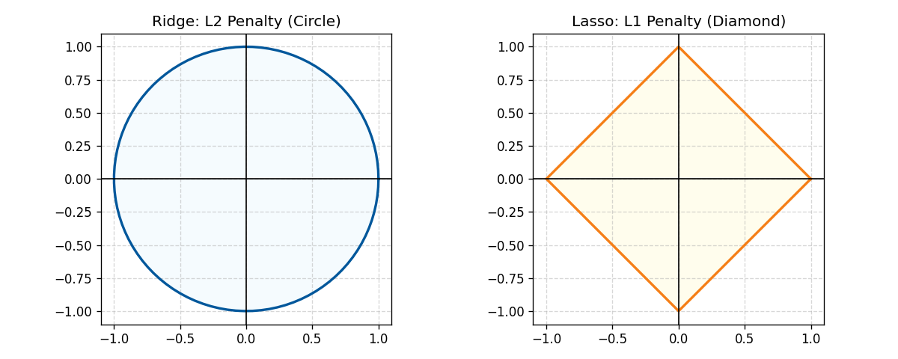
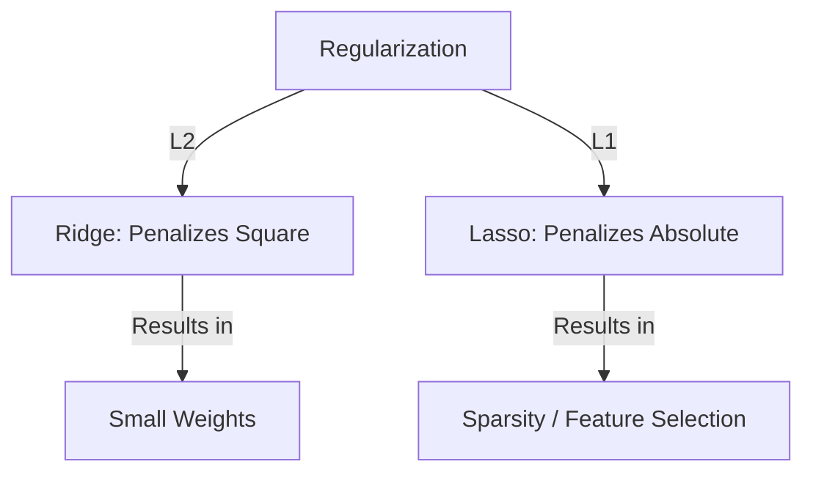

# 2.1.2 Ridge and Lasso Regression (Regularization)

Linear Regression is prone to **Overfitting**, especially when we have many features or when features are highly correlated (Multicollinearity). **Regularization** is the technique used to prevent this by adding a penalty to the cost function.

---

## 1. The Core Problem: Overfitting vs. Underfitting

To understand regularization, we must first understand the "Bias-Variance Tradeoff."

### A. Underfitting (High Bias)
- **What it is:** The model is too simple to capture the underlying pattern of the data.
- **Problem:** It performs poorly on both the training data and the test data.
- **Cause:** Choosing a linear model for non-linear data, or having too few features.
- **Analogy:** Trying to describe a complex painting using only two colors.

### B. Overfitting (High Variance)
- **What it is:** The model is too complex and "memorizes" the training data, including the noise.
- **Problem:** It performs exceptionally well on training data but fails miserably on new, unseen data (test data).
- **Cause:** Having too many features ($k$) relative to the number of observations ($n$), or training for too long.
- **Analogy:** Memorizing the answers to a specific exam instead of learning the subject.

### Comparison Table

| Feature | Underfitting | Overfitting |
| :--- | :--- | :--- |
| **Bias** | **High** (Strong assumptions) | **Low** (Flexible assumptions) |
| **Variance** | **Low** (Stable predictions) | **High** (Erratic predictions) |
| **Train Error** | High | Low |
| **Test Error** | High | High |
| **Complexity** | Too Simple | Too Complex |
| **Goal** | Find the "Sweet Spot" in the middle | |

---

## 2. The Solution: Regularization
We modify the Cost Function to penalize large coefficients.

$$J(\beta) = \text{MSE} + \text{Penalty Term}$$

There are two main types of regularization:

### A. Ridge Regression (L2 Regularization)
Ridge adds the **sum of squares** of the coefficients to the cost function.

$$J(\beta) = \frac{1}{2m} \sum_{i=1}^{m} (h_\beta(x^{(i)}) - y^{(i)})^2 + \lambda \sum_{j=1}^{k} \beta_j^2$$

- **$\lambda$ (Alpha):** The tuning parameter that controls the strength of the penalty.
- **Effect:** It "shrinks" the coefficients towards zero, but **never exactly to zero**. 
- **Use Case:** Best when you have many features that all contribute slightly to the output.

### B. Lasso Regression (L1 Regularization)
Lasso adds the **sum of absolute values** of the coefficients to the cost function.

$$J(\beta) = \frac{1}{2m} \sum_{i=1}^{m} (h_\beta(x^{(i)}) - y^{(i)})^2 + \lambda \sum_{j=1}^{k} |\beta_j|$$

- **Effect:** It can shrink coefficients **all the way to zero**.
- **Feature Selection:** Because it eliminates useless features, Lasso acts as an automatic feature selector.
- **Use Case:** Best when you suspect only a few features are actually important.

---

## 3. Comparison Table

| Feature | Ridge (L2) | Lasso (L1) |
| :--- | :--- | :--- |
| **Penalty** | Square of coefficients ($\beta^2$) | Absolute value of coefficients ($|\beta|$) |
| **Shrinkage** | Shrinks towards zero | Can shrink to exactly zero |
| **Feature Selection** | No | **Yes** |
| **Handling Multicollinearity** | Very good | Good (but picks one feature arbitrarily) |

---

## 4. Visualizing Coefficient Shrinkage

---

## 5. Deep Dive: Why Lasso (L1) Hits Zero (Reusing our Example)

Let's take our example from **Chapter 2.1.1 (Linear Regression)** and see how regularization changes the "Dry Run" update.

### Recall our Setup:
- **Data Points:** $(1, 2), (2, 4), (3, 7)$
- **Initial Guess:** $\beta_1 = 1.0$
- **Gradient without penalty:** $-5.66$ (calculated in Ch 2.1.1)
- **Learning Rate ($\alpha$):** $0.1$
- **Regularization Strength ($\lambda$):** $10$

### A. Ridge (L2) Update
The gradient now includes the penalty term $2\lambda\beta_1$:
$$\text{New Gradient} = \text{Old Gradient} + (2 \lambda \beta_1)$$
$$\text{New Gradient} = -5.66 + (2 \cdot 10 \cdot 1.0) = \mathbf{14.34}$$

$$\text{Update: } \beta_1 := 1.0 - (0.1 \cdot 14.34) = \mathbf{-0.434}$$
*Observation: The positive penalty "pulled" the weight down much harder than the data pulled it up.*

### B. Lasso (L1) Update: The Feature Selection Magic
Now imagine we have a second, **useless feature** $\beta_2$ (like "Door Color") that the model initially guessed was **$0.5$** by mistake.

- **Data's Pull:** Since it's useless, the data gradient is nearly $0$.
- **Lasso's Pull:** The penalty gradient is $\lambda \cdot \text{sign}(\beta_2)$.

If $\beta_2 = 0.5$ and $\lambda = 10$:
$$\beta_2 := 0.5 - \alpha (\text{Data Gradient} + \lambda)$$
$$\beta_2 := 0.5 - 0.1 (0 + 10) = \mathbf{-0.5}$$

**Crucial Point:** In one step, Lasso pulled the weight from $0.5$ to $-0.5$. In the very next iteration, it will hit **exactly zero** and stay there because the constant force of $\lambda$ will "pin" it at the origin. 

**Ridge (L2)** would have updated it to $0.5 - 0.1(2 \cdot 10 \cdot 0.5) = 0.4$, then $0.32$, then $0.25...$ getting smaller and smaller but **never hitting zero**.

---

## 6. The Mathematics of Selection: Soft Thresholding

To see how Lasso actually "selects" features, we look at the **Soft Thresholding** operator. In a simplified case, the Lasso coefficient $\beta_j$ can be calculated directly from the unregularized coefficient $\hat{\beta}_j^{OLS}$.

### The Thresholding Formula:
$$\beta_j^{Lasso} = \text{sign}(\hat{\beta}_j^{OLS}) \cdot \max(0, |\hat{\beta}_j^{OLS}| - \frac{\lambda}{2})$$

### How the "Selection" Happens:
This formula creates a **dead zone** around zero. 

1.  **Deletion Condition:** If the "signal" of the feature is weak ($|\hat{\beta}_j^{OLS}| \le \frac{\lambda}{2}$), the $\max$ function returns **0**. 
    - **Mathematical Result:** The feature is completely removed from the prediction equation: $\hat{y} = \dots + (0 \cdot X_j) + \dots$
2.  **Selection Condition:** If the "signal" is strong ($|\hat{\beta}_j^{OLS}| > \frac{\lambda}{2}$), the feature is kept but its weight is reduced (shrunk) by the threshold amount.

### Comparison to Ridge (Scaling)
Ridge doesn't have a threshold; it has a **scaling factor**:
$$\beta_j^{Ridge} = \frac{\hat{\beta}_j^{OLS}}{1 + \lambda}$$
- No matter how small the signal $\hat{\beta}_j^{OLS}$ is, the result is always a non-zero fraction. 

### Why this "helps":
Mathematically, Lasso **sets the sparsity** of the model. It defines a "minimum importance" threshold ($ \lambda/2 $). Any feature that doesn't meet this threshold is mathematically proven to be useless for the model's objective and is discarded.

---

## 7. Regularization vs. Loss Functions

Think of them as two different parts of a single equation:

$$ \underbrace{\text{Objective Function}}_{\text{The "Boss"}} = \underbrace{\text{Loss Function}}_{\text{Fuel (MSE)}} + \underbrace{\text{Regularization}}_{\text{Brakes (L1/L2)}} $$

1.  **Loss Function:** Measures how wrong you are (Accuracy).
2.  **Regularization:** Measures how complex you are (Simplicity).
3.  **The Objective:** Finds the balance where you are as accurate as possible while being as simple as possible.

---

## Navigation
- [<- Back to Main Index](../../README.md)
- [^ Back to Chapter 2 Index](../c2-supervised-learning.md)
- [2.2.1 Logistic Regression ->](logistic-regression.md)
