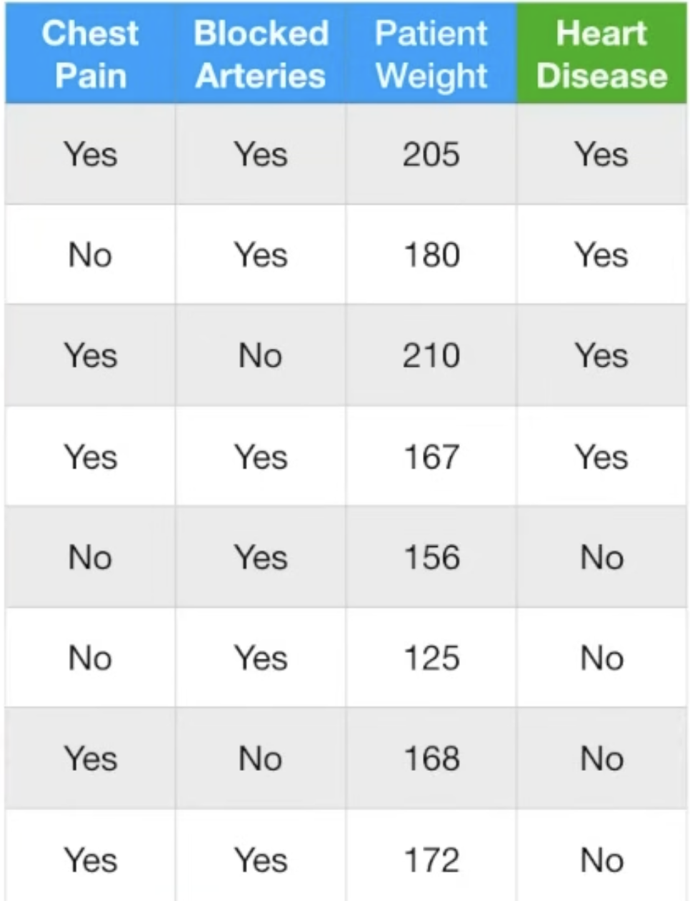

# Walkthrough: Sequential Learning in AdaBoost

In this example, we will manually build **two stumps in series** using the Heart Disease dataset. We will track the "Ledger" of weights to see exactly how mistakes shift the AI's focus.

---

## 1. Initial State: Equal Weights
We start with 8 patients. Every patient gets an equal weight of $1/8$ ($0.125$).

**Table 1: State before Stump #1**
| Patient | Chest Pain | Arteries | Patient Weight | Target | Stump 1 Weight |
| :--- | :--- | :--- | :--- | :--- | :--- |
| **P1** | Yes | Yes | 205 | Yes | 0.125 |
| **P2** | No | Yes | 180 | Yes | 0.125 |
| **P3** | Yes | No | 210 | Yes | 0.125 |
| **P4** | Yes | Yes | 167 | Yes | 0.125 |
| **P5** | No | Yes | 156 | No | 0.125 |
| **P6** | No | Yes | 125 | No | 0.125 |
| **P7** | Yes | No | 168 | No | 0.125 |
| **P8** | Yes | Yes | 172 | No | 0.125 |

---

## 2. The Battle for Stump #1: Calculating Gini

To pick the first stump, the AI tests the features and calculates their **Weighted Gini Impurity**. (Since all weights are equal right now, this is identical to a standard Gini calculation).

**Parent Gini:** 4 Yes, 4 No. Gini = $1 - (0.5)^2 - (0.5)^2 = \mathbf{0.50}$

### A. Testing "Blocked Arteries"
- **Yes (P1, P2, P4, P5, P6, P8):** 3 Yes, 3 No. 
  - Gini = $1 - (3/6)^2 - (3/6)^2 = \mathbf{0.50}$
- **No (P3, P7):** 1 Yes, 1 No. 
  - Gini = $1 - (1/2)^2 - (1/2)^2 = \mathbf{0.50}$
- **Weighted Average Gini:** $(6/8 \times 0.50) + (2/8 \times 0.50) = \mathbf{0.50}$

### B. Testing "Chest Pain"
- **Yes (P1, P3, P4, P7, P8):** 3 Yes, 2 No. 
  - Gini = $1 - (3/5)^2 - (2/5)^2 = 1 - 0.36 - 0.16 = \mathbf{0.48}$
- **No (P2, P5, P6):** 1 Yes, 2 No. 
  - Gini = $1 - (1/3)^2 - (2/3)^2 \approx 1 - 0.11 - 0.44 = \mathbf{0.45}$
- **Weighted Average Gini:** $(5/8 \times 0.48) + (3/8 \times 0.45) = 0.30 + 0.168 \approx \mathbf{0.468}$

*(Note: While testing a specific numerical split like 'Patient Weight > 175' might yield a lower Gini mathematically, we will restrict Stump #1 to the categorical symptoms to observe how AdaBoost handles multiple simultaneous mistakes).*

**The Winner:** "Chest Pain" removes more chaos (0.468 < 0.50). It becomes Stump #1!

---

## 3. Stump #1: Errors and "Amount of Say"
Now we run the winning stump (Chest Pain) to find its error rate.

- **Branch: Chest Pain = YES (P1, P3, P4, P7, P8)**
  - Targets: 3 Yes, 2 No. **Majority: YES.**
  - Mistakes: **P7, P8**.
- **Branch: Chest Pain = NO (P2, P5, P6)**
  - Targets: 1 Yes, 2 No. **Majority: NO.**
  - Mistakes: **P2**.

**Total Error ($\epsilon$):** $0.125 + 0.125 + 0.125 = \mathbf{0.375}$
**Amount of Say ($\alpha$):** $\frac{1}{2} \ln(\frac{1-0.375}{0.375}) \approx \mathbf{0.255}$

---

## 4. The Weight Shift (Punishing the Mistakes)
We update weights for **Stump #2**.
- **Correct (P1, P3, P4, P5, P6):** $0.125 \times e^{-0.255} \approx \mathbf{0.097}$
- **Incorrect (P2, P7, P8):** $0.125 \times e^{+0.255} \approx \mathbf{0.161}$

*(After normalizing to sum back to 1.0)*:

**Table 2: State before Stump #2**
| Patient | Chest Pain | Arteries | Patient Weight | Target | Stump 2 Weight |
| :--- | :--- | :--- | :--- | :--- | :--- |
| **P1** | Yes | Yes | 205 | Yes | 0.10 |
| **P2** | No | Yes | 180 | Yes | **0.17** ⬆️ |
| **P3** | Yes | No | 210 | Yes | 0.10 |
| **P4** | Yes | Yes | 167 | Yes | 0.10 |
| **P5** | No | Yes | 156 | No | 0.10 |
| **P6** | No | Yes | 125 | No | 0.10 |
| **P7** | Yes | No | 168 | No | **0.17** ⬆️ |
| **P8** | Yes | Yes | 172 | No | **0.17** ⬆️ |

---

## 5. Stump #2: Patient Weight > 175
Because **P2, P7, and P8** are now "Heavy," the AI is mathematically forced to find a feature that gets them right. Let's test **Patient Weight > 175**:

- **Branch: Weight > 175 (P1, P2, P3)**
  - Weights: P1(0.10), P2(0.17), P3(0.10).
  - Targets: All YES. **Majority: YES.**
  - **Mistakes: Zero.** (It successfully corrected P2!)

- **Branch: Weight <= 175 (P4, P5, P6, P7, P8)**
  - Weights: P4(0.10), P5(0.10), P6(0.10), P7(0.17), P8(0.17).
  - Targets: 1 Yes (P4), 4 No. **Majority: NO.**
  - **Mistake: P4**. (It successfully corrected P7 and P8!)

**Total Weighted Error:** Only P4 is wrong. Error = **0.10**.
**Amount of Say ($\alpha$):** $\frac{1}{2} \ln(\frac{1-0.10}{0.10}) \approx \mathbf{1.09}$
*(Notice how much higher this score is because the error was so low!)*

---

## 6. The Second Weight Shift
Now we update the weights again, preparing for Stump #3.

- **Correct (P1, P2, P3, P5, P6, P7, P8):** Weight $\times e^{-1.09}$ (Decreased dramatically)
- **Incorrect (P4):** Weight $\times e^{+1.09}$ (Increased dramatically)

*(After normalizing to sum back to 1.0)*:

**Table 3: State before Stump #3**
| Patient | Patient Weight | Target | Stump 3 Weight |
| :--- | :--- | :--- | :--- |
| **P1** | 205 | Yes | 0.055 |
| **P2** | 180 | Yes | 0.093 |
| **P3** | 210 | Yes | 0.055 |
| **P4** | 167 | Yes | **0.490** ⬆️⬆️ |
| **P5** | 156 | No | 0.055 |
| **P6** | 125 | No | 0.055 |
| **P7** | 168 | No | 0.093 |
| **P8** | 172 | No | 0.093 |

---

## 7. Conclusion: The Domino Effect
Look at what just happened to **Patient 4**:
1.  **Stump #1** got P4 right. Its weight dropped.
2.  **Stump #2** was so desperate to fix P2, P7, and P8 that it was willing to sacrifice P4 to make it happen.
3.  **Result:** Going into Stump #3, Patient 4 now holds nearly **50% of the entire dataset's weight.**

Stump #3 will have absolutely no choice but to find a rule that gets P4 right, even if it has to sacrifice someone else. This constant "shifting of the spotlight" is what makes AdaBoost an adaptive, self-correcting machine!

---

## Navigation
- [<- Back to AdaBoost Theory](adaboost.md)
- [^ Back to Chapter 2 Index](../c2-supervised-learning.md)
