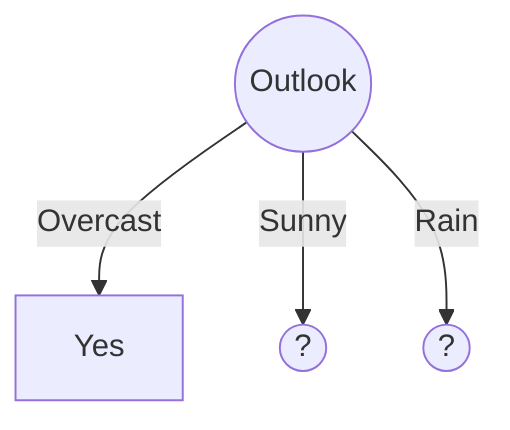
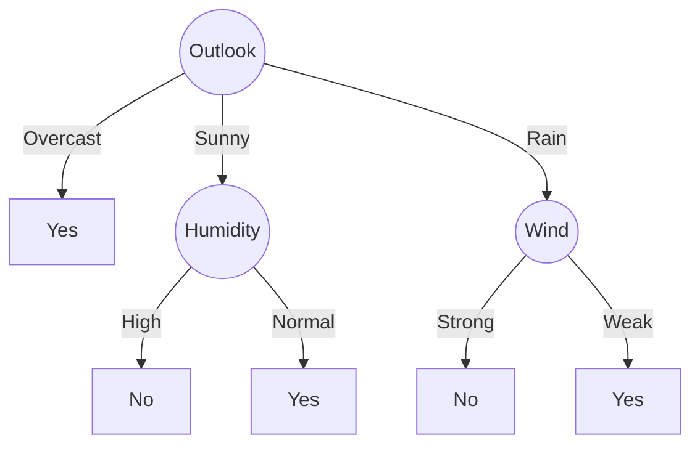

# Walkthrough: Building a Decision Tree (Play Tennis)

In this example, we manually calculate **Information Gain** to see how a Decision Tree determines its structure.

---

## 1. The Starting Point: Parent Entropy
Total Days: 14 | **Yes: 9** | **No: 5**

**Starting Entropy:**
$$H(S) = - \frac{9}{14} \log_2(\frac{9}{14}) - \frac{5}{14} \log_2(\frac{5}{14}) \approx \mathbf{0.940}$$

---

## 2. Choosing the Root Node (The Battle of Features)

To pick the first question, the AI calculates **Information Gain** for *every* available feature. The one with the highest gain wins.

### A. Splitting on "Outlook"
| Category | Data (Yes/No) | Entropy |
| :--- | :--- | :--- |
| **Sunny** | 2 Yes, 3 No | 0.971 |
| **Overcast** | 4 Yes, 0 No | **0.000** |
| **Rain** | 3 Yes, 2 No | 0.971 |

**Weighted Entropy:** $(\frac{5}{14} \times 0.971) + (\frac{4}{14} \times 0) + (\frac{5}{14} \times 0.971) = \mathbf{0.693}$
**Information Gain:** $0.940 - 0.693 = \mathbf{0.247}$

---

### B. Splitting on "Temperature"
| Category | Data (Yes/No) | Entropy |
| :--- | :--- | :--- |
| **Hot** | 2 Yes, 2 No | 1.000 |
| **Mild** | 4 Yes, 2 No | 0.918 |
| **Cool** | 3 Yes, 1 No | 0.811 |

**Weighted Entropy:** $(\frac{4}{14} \times 1.0) + (\frac{6}{14} \times 0.918) + (\frac{4}{14} \times 0.811) = \mathbf{0.911}$
**Information Gain:** $0.940 - 0.911 = \mathbf{0.029}$

---

### C. Splitting on "Humidity"
| Category | Data (Yes/No) | Entropy |
| :--- | :--- | :--- |
| **High** | 3 Yes, 4 No | 0.985 |
| **Normal** | 6 Yes, 1 No | 0.592 |

**Weighted Entropy:** $(\frac{7}{14} \times 0.985) + (\frac{7}{14} \times 0.592) = \mathbf{0.788}$
**Information Gain:** $0.940 - 0.788 = \mathbf{0.152}$

---

### D. Splitting on "Wind"
| Category | Data (Yes/No) | Entropy |
| :--- | :--- | :--- |
| **Weak** | 6 Yes, 2 No | 0.811 |
| **Strong** | 3 Yes, 3 No | 1.000 |

**Weighted Entropy:** $(\frac{8}{14} \times 0.811) + (\frac{6}{14} \times 1) = \mathbf{0.892}$
**Information Gain:** $0.940 - 0.892 = \mathbf{0.048}$

---

## 3. The Root Node Leaderboard
The AI compares the scores:

1. **Outlook:** **0.247** 🏆 (Winner)
2. **Humidity:** 0.152
3. **Wind:** 0.048
4. **Temperature:** 0.029

**Verdict:** The AI picks **Outlook** as the Root Node because it removes the most "chaos" from the data.

---

## 4. The Tree after Step 1
Since Outlook has the highest gain, it becomes the **Root Node**.

*Notice: The "Overcast" branch is finished because its entropy is 0.*

---

## 5. Growing the "Sunny" Branch
We now focus **only** on the 5 Sunny days (2 Yes, 3 No). Let's test **Humidity**:

| Humidity | Data (Yes/No) | Entropy |
| :--- | :--- | :--- |
| **High** | 0 Yes, 3 No | **0.000** (Pure!) |
| **Normal** | 2 Yes, 0 No | **0.000** (Pure!) |

**Information Gain (Humidity):** $0.971 - 0 = \mathbf{0.971}$ (Maximum possible gain!)

---

## 6. The Final Tree
By repeating this for every branch, we get this logical flowchart:

---

## 7. Real-World Application
Imagine a new day: **Sunny, Cool, High Humidity, Strong Wind.**
1.  **Outlook?** Sunny. (Go to Humidity node).
2.  **Humidity?** High. (Go to No leaf).
**AI Prediction: No, don't play.**

---

## Navigation
- [<- Back to Decision Tree Theory](decision-trees.md)
- [^ Back to Chapter 2 Index](../c2-supervised-learning.md)
