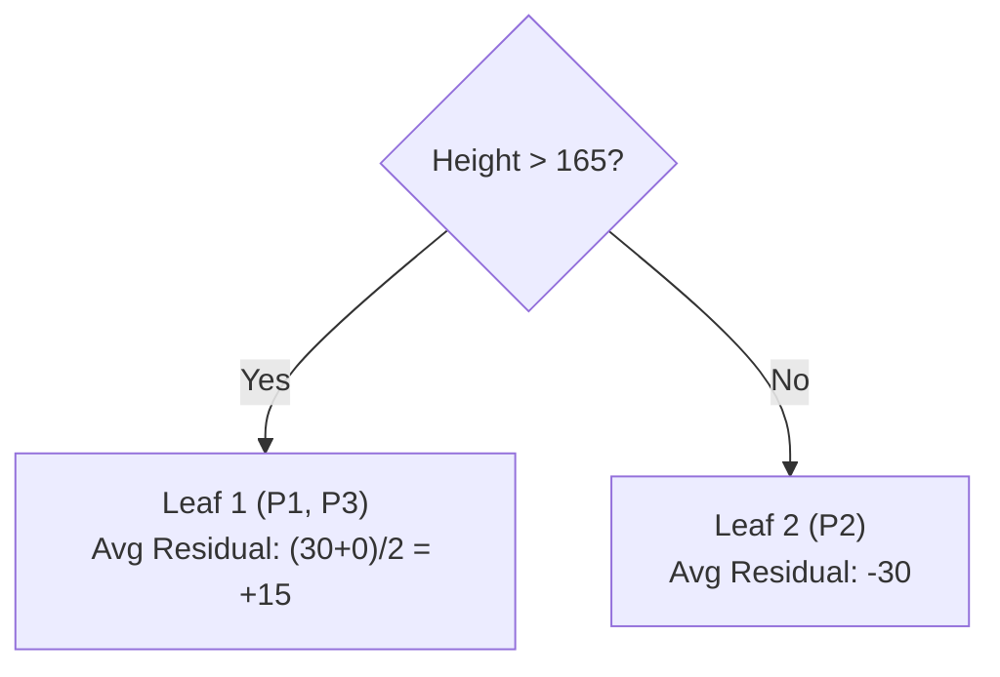
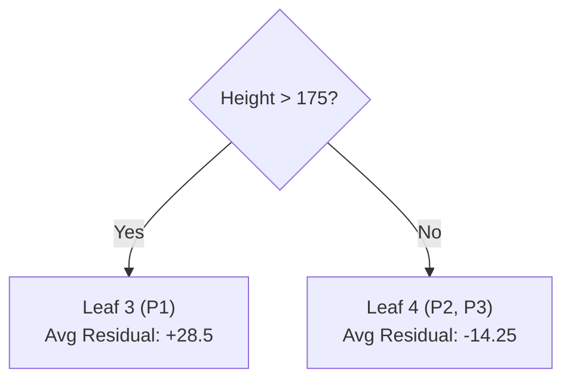
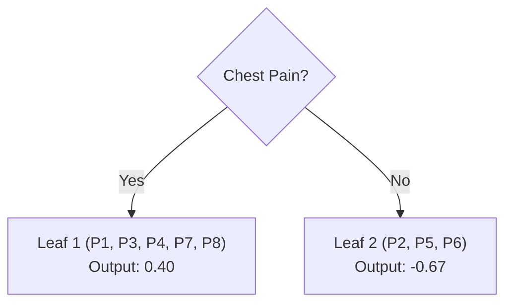
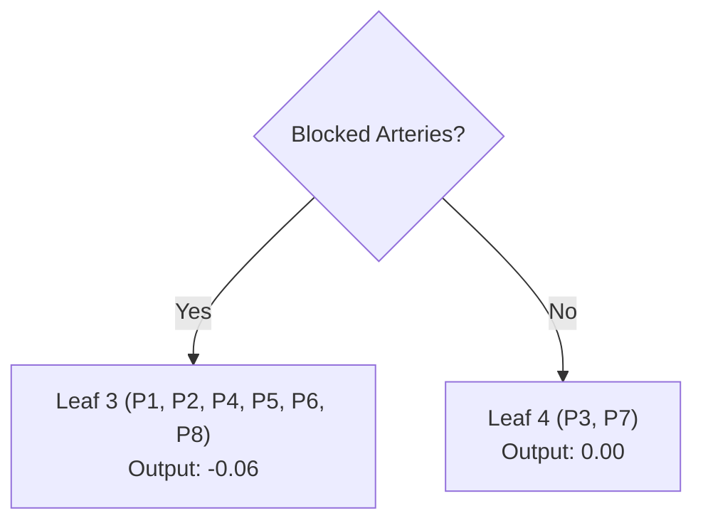

# Walkthrough: Gradient Boosting (2 Full Iterations)

In this walkthrough, we will trace **two sequential trees** for both **Regression** and **Classification** with explicit ledger tables.

---

## Part 1: Regression (Predicting Weight)

**Dataset:**

| Patient | Height (cm) | Weight (Target) |
| :--- | :--- | :--- |
| **P1** | 180 | 200 |
| **P2** | 160 | 140 |
| **P3** | 170 | 170 |

### Iteration 1

1. **Step 0: Initial Guess ($F_0$):** Average Weight = **170**.

2. **Step 1: The Residuals Table**

| Patient | Height | Actual | Current Guess | Residual ($r_1$) |
| :--- | :--- | :--- | :--- | :--- |
| **P1** | 180 | 200 | 170 | **+30** |
| **P2** | 160 | 140 | 170 | **-30** |
| **P3** | 170 | 170 | 170 | **0** |

3. **Step 2: Choosing the Split (Height > 165)**
How did we pick **165**?
- The AI sorts the heights: 160, 170, 180.
- It tests midpoints: **165** (between 160-170) and **175** (between 170-180).
- For each midpoint, it calculates the **Sum of Squared Residuals (SSR)** for the resulting leaves. 
- **165** yielded the lowest error, so it becomes the root.

4. **Step 3: Tree #1**

5. **Step 4: Update ($F_1$) with Learning Rate 0.1**
- **P1 New Guess:** $170 + (0.1 \times 15) = \mathbf{171.5}$
- **P2 New Guess:** $170 + (0.1 \times -30) = \mathbf{167.0}$
- **P3 New Guess:** $170 + (0.1 \times 15) = \mathbf{171.5}$

---

### Iteration 2 (Shaving more error)

1. **Step 1: The New Residuals Table**

| Patient | Height | Actual | Guess ($F_1$) | NEW Residual ($r_2$) |
| :--- | :--- | :--- | :--- | :--- |
| **P1** | 180 | 200 | 171.5 | **+28.5** |
| **P2** | 160 | 140 | 167.0 | **-27.0** |
| **P3** | 170 | 170 | 171.5 | **-1.5** |

2. **Step 2: Tree #2 (Split at Height > 175)**

3. **Step 3: Update ($F_2$) with LR = 0.1**
- **P1 New Guess:** $171.5 + (0.1 \times 28.5) = \mathbf{174.35}$ (Moving toward 200!)
- **P2 New Guess:** $167.0 + (0.1 \times -14.25) = \mathbf{165.57}$ (Moving toward 140!)

---

## Part 2: Classification (Heart Disease)

### Iteration 1

1. **Step 0: Initial Guess (Log-Odds):** $\ln(4/4) = \mathbf{0}$.
2. **Step 1: The Residuals Table** (Initial Prob = 0.5)

| Patient | Observed | Initial Prob | Pseudo-Residual ($r_1$) |
| :--- | :--- | :--- | :--- |
| **P1-P4** | 1 | 0.5 | **+0.5** |
| **P5-P8** | 0 | 0.5 | **-0.5** |

3. **Step 2: Tree #1 (Chest Pain)**

*(Formula used: $\frac{\sum Residuals}{\sum P(1-P)}$)*

4. **Step 3: Update ($F_1$) with LR = 0.1**
- **P1 (Leaf 1) Log-Odds:** $0 + (0.1 \times 0.40) = \mathbf{0.04}$
- **P1 New Probability:** $\frac{e^{0.04}}{1+e^{0.04}} \approx \mathbf{0.51}$

---

### Iteration 2

1. **Step 1: The NEW Residuals Table**

| Patient | Observed | Prev Prob | NEW Residual ($r_2$) |
| :--- | :--- | :--- | :--- |
| **P1** | 1 | 0.51 | **+0.49** |
| **P7** | 0 | 0.51 | **-0.51** |

2. **Step 2: Tree #2 (Blocked Arteries)**

3. **Step 3: Update ($F_2$)**
The probabilities continue their slow crawl toward 1.0 or 0.0.

---

## Navigation
- [<- Back to Theory](gradient-boosting.md)
- [^ Back to Chapter 2 Index](../c2-supervised-learning.md)
