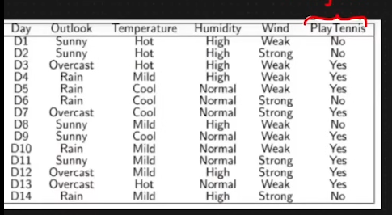

# Walkthrough: Playing Tennis with Naive Bayes

In this example, we will use the "Play Tennis" dataset to see how Naive Bayes transforms raw data into a smart prediction.

---

## 1. The Scenario
It is a **Sunday morning**. You look out the window and see the following conditions:
- **Outlook:** Sunny
- **Temperature:** Cool
- **Humidity:** High
- **Wind:** Strong

**The Question:** Should you go play tennis? Let's see what the AI says.

---

## 2. Step 1: Gather the "Guts" (Priors)
First, the AI looks at history (the 14 days in the table) to see how often people play in general.

- **Total Days:** 14
- **Days played (Yes):** 9
- **Days skipped (No):** 5

**Prior Probabilities:**
- $P(\text{Yes}) = 9 / 14 \approx \mathbf{0.64}$
- $P(\text{No}) = 5 / 14 \approx \mathbf{0.36}$

---

## 3. Step 2: The "Profile" (Likelihoods)
Now, the AI looks at how common our Sunday conditions are for both "Yes" days and "No" days.

### Detailed Breakdown: How to calculate "Outlook = Sunny"
To get these numbers, we look at the table and manually count.

**1. For the "Yes" Group (9 days total):**
- Look only at the days where PlayTennis = **Yes**.
- How many of those days have Outlook = **Sunny**?
- Scan the table: Day 9 and Day 11. (Total = **2**)
- **Likelihood:** $2 / 9 \approx \mathbf{0.22}$

**2. For the "No" Group (5 days total):**
- Look only at the days where PlayTennis = **No**.
- How many of those days have Outlook = **Sunny**?
- Scan the table: Day 1, Day 2, and Day 8. (Total = **3**)
- **Likelihood:** $3 / 5 = \mathbf{0.60}$

---

### The Full Likelihood Table
By repeating this "Count and Divide" logic for every condition, we get this table:

| Feature | Condition | $P(\text{Condition} \mid \text{Yes})$ | $P(\text{Condition} \mid \text{No})$ |
| :--- | :--- | :--- | :--- |
| **Outlook** | Sunny | $2 / 9 \approx 0.22$ | $3 / 5 = 0.60$ |
| **Temp** | Cool | $3 / 9 \approx 0.33$ | $1 / 5 = 0.20$ |
| **Humidity** | High | $3 / 9 \approx 0.33$ | $4 / 5 = 0.80$ |
| **Wind** | Strong | $3 / 9 \approx 0.33$ | $3 / 5 = 0.60$ |

---

## 4. Step 3: The Calculation (Multiplying it all)
This is where the "Naive" part happens. 

### The "Naive" Secret
In a "perfect" world (Real Bayes), to find the probability of our Sunday, we would have to look through the table for a day that was **exactly** Sunny AND Cool AND High AND Strong. 

**The Problem:** Look at the table. Does that exact day exist? **No.** 

If we used "Normal" probability, the answer would be **0** because we've never seen that exact combination before. This is where the AI would get stuck.

**The "Naive" Solution:** We assume that Outlook, Temp, Humidity, and Wind are **independent**. This allows us to simply multiply their individual probabilities together to *estimate* the probability of the whole day.

### Score for "Yes":
$0.64 (\text{Prior}) \times 0.22 (\text{Sunny}) \times 0.33 (\text{Cool}) \times 0.33 (\text{High}) \times 0.33 (\text{Strong})$
**Result $\approx 0.0053$**

### Score for "No":
$0.36 (\text{Prior}) \times 0.60 (\text{Sunny}) \times 0.20 (\text{Cool}) \times 0.80 (\text{High}) \times 0.60 (\text{Strong})$
**Result $\approx 0.0205$**

---

## 5. Step 4: The Decision (MAP)
The AI compares the two scores:
- **Yes:** 0.0053
- **No:** 0.0205

**Conclusion:** Since the "No" score is significantly higher, the AI predicts **No, don't play tennis today.**

---

## Why did it pick "No"?
Even though your "gut feeling" ($P(\text{Yes})$) was high ($64\%$), the **evidence** for "No" was much stronger for these specific conditions. Specifically, in the past, when it was Sunny and High Humidity, you almost never played (3 out of 5 "No" days were Sunny).

Naive Bayes effectively "outweighed" your initial gut feeling with the specific evidence of the day.

---

## Navigation
- [<- Back to Naive Bayes Theory](naive-bayes.md)
- [^ Back to Chapter 2 Index](../c2-supervised-learning.md)
