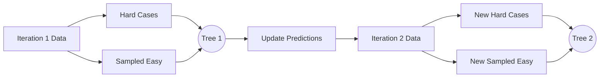

# Walkthrough: The Big Three in Action

This walkthrough traces **two full iterations** for XGBoost, LightGBM, and CatBoost using manual math and step-by-step updates.

---

## Part 1: XGBoost (Regularization & Pruning)

**Dataset:** 3 Patients (P1, P2, P3). Initial Prob = 0.5. $\lambda = 1, \gamma = 0.5$.
- P1 (Target: 1, Res: +0.5)
- P2 (Target: 1, Res: +0.5)
- P3 (Target: 0, Res: -0.5)

### Iteration 1

1. **Step 1: Root Similarity Score**
   $$\frac{(0.5 + 0.5 - 0.5)^2}{(0.5 \times 0.5 \times 3) + 1} = \frac{0.25}{1.75} = \mathbf{0.14}$$

2. **Step 2: Test Split (Feature A):** Left: {P1, P2}, Right: {P3}
   - **Left Score:** $\frac{(1)^2}{(0.25 \times 2) + 1} = \frac{1}{1.5} = \mathbf{0.67}$
   - **Right Score:** $\frac{(-0.5)^2}{0.25 + 1} = \frac{0.25}{1.25} = \mathbf{0.20}$
   - **Gain:** $0.67 + 0.20 - 0.14 = \mathbf{0.73}$
   - *Since Gain (0.73) > Gamma (0.5), we keep the split.*

3. **Step 3: Update Prediction ($F_1$) with LR = 0.1**
   - Output (Left): 0.67, Output (Right): 0.20
   - **P1 New Log-Odds:** $0 + (0.1 \times 0.67) = \mathbf{0.067}$
   - **P1 New Prob:** $\frac{e^{0.067}}{1+e^{0.067}} \approx \mathbf{0.517}$

### Iteration 2

1. **Step 1: Calculate New Residuals**
   - P1: $1 - 0.517 = \mathbf{0.483}$
   - P3: $0 - \text{Prob}_{P3} = \mathbf{-0.495}$ (roughly)

2. **Step 2: New Tree Construction**
   The AI builds a second tree to predict these slightly smaller residuals, applying the Similarity Score formula again to decide on the next split.

---

## Part 2: LightGBM (GOSS & Histograms)

**Dataset:** 100 Patients. 10 "Hard" (Large Grad), 90 "Easy" (Small Grad).

### Iteration 1

1. **GOSS Sampling:** 
   - Keep all 10 Hard patients.
   - Randomly sample 10 Easy patients ($b = 10/90 \approx 11\%$).
2. **The Weighting:** 
   - Sampled "Easy" residuals are multiplied by $\frac{1-0.10}{0.11} = \mathbf{8.18}$.
3. **Tree #1:** The tree is built using these 20 rows (10 weighted, 10 normal).

### Iteration 2

1. **Residual Update:** Predictions are updated ($Guess = Guess + 0.1 \times Tree1$).
2. **New GOSS Sample:** The AI looks at the *new* gradients. Some "Hard" patients might have become "Easy."
   - A **new** random sample of easy patients is taken.
   - A **new** weighted tree is built to "chisel" the remaining error.

---

## Part 3: CatBoost (Ordered Target Encoding)

**Feature:** "City". Targets: London (P1:Y, P2:N, P3:Y). Prior = 0.5.

### Iteration 1: Random Permutation [P2, P1, P3]

| Order | Patient | Past Sum | Past Count | Encoded Value |
| :--- | :--- | :--- | :--- | :--- |
| 1 | **P2** | 0 | 0 | $(0 + 0.5) / (0 + 1) = \mathbf{0.50}$ |
| 2 | **P1** | 0 | 1 | $(0 + 0.5) / (1 + 1) = \mathbf{0.25}$ |
| 3 | **P3** | 1 | 2 | $(0 + 1 + 0.5) / (2 + 1) = \mathbf{0.50}$ |

### Iteration 2: NEW Random Permutation [P3, P2, P1]

| Order | Patient | Past Sum | Past Count | Encoded Value |
| :--- | :--- | :--- | :--- | :--- |
| 1 | **P3** | 0 | 0 | $\mathbf{0.50}$ |
| 2 | **P2** | 1 | 1 | $(1 + 0.5) / (1 + 1) = \mathbf{0.75}$ |
| 3 | **P1** | 1 | 2 | $(1 + 0 + 0.5) / (3) = \mathbf{0.50}$ |

**The Magic:** Because the encoded values change between trees, the model can't "memorize" a static number for London. It must learn the actual relationship with the target.

---

## Navigation
- [<- Back to Theory](xgboost-lightgbm-catboost.md)
- [^ Back to Chapter 2 Index](../c2-supervised-learning.md)
