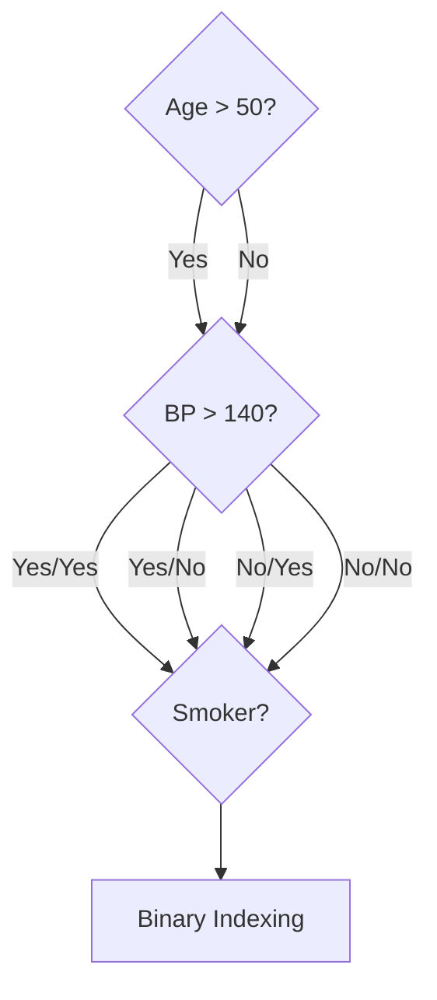

# 2.3.7 The Big Three: XGBoost, LightGBM, and CatBoost

Standard Gradient Boosting is the foundation, but these three libraries are the "Industrial Saws" of machine learning. They solve the speed and overfitting problems of "vanilla" GBM using advanced engineering and math.

---

## 1. XGBoost: The Regularizer
XGBoost focuses on **Regularization** (preventing overfitting) and **Pruning**.

### Growth Strategy: Level-Wise (The Skyscraper)
XGBoost builds trees layer-by-layer. Imagine building a skyscraper: you must finish the entire 2nd floor before starting the 3rd. 
- **The "Look Ahead" Advantage:** By building the tree deep and then pruning from the bottom-up, XGBoost can find amazing splits that are hidden behind a "terrible" first split. A "greedy" model would never find them.

### The Math: Similarity Score
Instead of just averaging residuals, XGBoost calculates a "Strength" score for each leaf.
$$\text{Similarity Score} = \frac{(\sum \text{Residuals})^2}{\sum [P \times (1 - P)] + \lambda}$$
- **$\lambda$ (Lambda):** The L2 Regularization parameter. A higher $\lambda$ makes the score smaller, making splits harder to justify.

### The Math: Gain (Decision to Split)
$$\text{Gain} = \text{Left Score} + \text{Right Score} - \text{Root Score}$$
- **$\gamma$ (Gamma):** The "Tax." If $\text{Gain} < \gamma$, the split is pruned.

---

## 2. LightGBM: The Speed Demon
LightGBM focuses on **Speed** and **Memory Efficiency** for massive datasets.

### Growth Strategy: Leaf-Wise
Instead of layers, LightGBM only splits the single leaf that reduces error the most.
- **The Speed Advantage:** It doesn't waste time on branches that don't help.
- **The Overfitting Risk:** Because it is so aggressive, it can "tunnel" into a specific group of noisy data. 
- **The Guardrail:** Always set `min_data_in_leaf` to prevent it from splitting on just 1 or 2 people.

### Engineering: Histograms (The 8-bit Trick)
Instead of testing millions of numbers, LightGBM groups features into **255 Bins**. 
- **Memory Magic:** Because there are < 256 bins, the computer can store values as **8-bit integers** instead of 32-bit floats. This reduces RAM usage by 75% and fits perfectly in the CPU's cache.
- **Auto-Regularization:** By "blurring" the exact decimals, the model ignores small noise and focuses on broad patterns.

### The Math: GOSS (Sampling)
LightGBM uses **Gradient-based One-Side Sampling**:
1.  Keep all instances with Large Gradients (Hard cases).
2.  Randomly sample $b\%$ of instances with Small Gradients (Easy cases).
3.  **Correction Factor:** Multiply the sampled "Easy" case contributions by $\frac{1-a}{b}$ to keep the math fair.

---

## 3. CatBoost: The Categorical Master
CatBoost handles text/categories natively without One-Hot Encoding.

### The Concept: Target Encoding (Reputation Scores)
CatBoost replaces "London" with a number representing its "Reputation" (probability of the target). This turns a word into a powerful mathematical signal.

### The Math: Ordered Target Encoding
To prevent "Cheating" (Target Leakage), CatBoost only calculates the reputation based on patients who came **before** the current one in a random shuffle.
$$\text{Value} = \frac{\text{Sum of Targets in Past} + \text{Prior}}{\text{Count of Occurrences in Past} + 1}$$

### Engineering: Symmetric (Oblivious) Trees
Every node at the same depth uses the exact same split condition.

- **Hardware Parallelism:** Because the questions are fixed, the CPU can ask all level-1, level-2, and level-3 questions **simultaneously** in parallel.
- **Binary Indexing:** Instead of navigating a maze, the computer calculates a binary code (e.g., `101`) and jumps directly to that leaf in memory.

---

## 4. Cheat Sheet: Which one to choose?

**Table 1: Algorithm Comparison**

| Scenario | Recommendation | Why? |
| :--- | :--- | :--- |
| **Default / Safe Bet** | **XGBoost** | Extremely well-documented, great community support, strong regularizations. |
| **Massive Data (>1M rows)** | **LightGBM** | Will train in a fraction of the time and use far less RAM due to Histograms. |
| **Lots of Text Categories** | **CatBoost** | Saves you hours of pre-processing. Very hard to overfit with default settings. |
| **Missing Data is a Signal** | **XGBoost** | Its default pathing for missing values often extracts hidden signals. |

> [!TIP]
> Checkout the [Exhaustive Walkthrough](sample-application-the-big-three.md) for the manual math behind these algorithms.

---

## Navigation
- [<- Back to Gradient Boosting](gradient-boosting.md)
- [^ Back to Chapter 2 Index](../c2-supervised-learning.md)
- [Exhaustive Walkthrough (Math & Tables) ->](sample-application-the-big-three.md)
