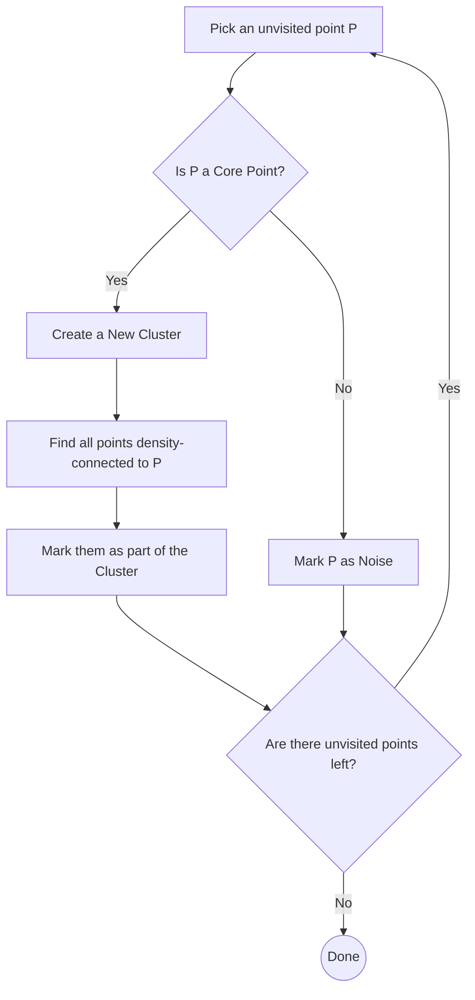

# 3.1.3 DBSCAN Clustering

**DBSCAN** (Density-Based Spatial Clustering of Applications with Noise) takes a fundamentally different approach than K-Means or Hierarchical clustering. Instead of relying on central anchors (centroids) or distance matrices, DBSCAN groups points based on **continuous density**.

---

## 1. The Core Philosophy
Think of DBSCAN like a virus spreading through a crowd. If people are standing close together (dense), the virus spreads and links them all into a single cluster. If there is a gap in the crowd (empty space), the virus stops. 

**Key Advantages:**
1.  **No Guessing $K$:** The algorithm automatically determines the number of clusters based on the physical gaps in the data.
2.  **Arbitrary Shapes:** It can easily cluster non-linear, complex shapes (like a "donut" or concentric rings) because the boundary is determined by local density, not straight lines.
3.  **Outlier Detection:** It naturally identifies and isolates points that don't belong to any cluster (Noise).

---

## 2. The Engine: Parameters & Point Types

To define what a "dense crowd" is, DBSCAN requires two parameters:
- **`epsilon` ($\epsilon$):** The maximum distance between two points for them to be considered neighbors (the "cough distance").
- **`min_samples`:** The minimum number of points required within the `epsilon` radius to form a dense region.

### The 3 Types of Points
Based on those parameters, every point in the dataset is labeled as one of the following:

| Point Type | Definition | Role in Cluster |
| :--- | :--- | :--- |
| **Core Point** | Has at least `min_samples` points within its $\epsilon$-radius (including itself). | The "super-spreaders." They form the thick heart of a cluster. |
| **Border Point** | Has fewer than `min_samples` within its $\epsilon$-radius, **BUT** is located within the $\epsilon$-radius of a Core Point. | The edges of the cluster. They are part of the group but cannot spread the cluster further. |
| **Noise (Outlier)** | Has fewer than `min_samples` in its $\epsilon$-radius, and is **NOT** within the radius of any Core Point. | Completely isolated. The algorithm ignores them and does not assign them to any cluster (usually labeled as `-1`). |

---

## 3. The Algorithm Flow

*Note: A point marked as "Noise" early on can later be updated to a "Border Point" if a growing cluster eventually reaches it.*

---

## 4. Pros and Cons

### Pros
- **Shape Agnostic:** Perfect for datasets that don't look like neat, spherical blobs.
- **Handles Noise:** Automatically filters out anomalies, whereas K-Means will forcefully pull centroids toward outliers.

### Cons
- **Varying Densities:** DBSCAN struggles massively if your dataset contains clusters of different densities. If you set $\epsilon$ small enough to separate a dense cluster, you will accidentally label a looser cluster entirely as "Noise."
- **High Dimensionality:** As the number of features (columns) increases, the concept of "distance" breaks down (The Curse of Dimensionality), making it very hard to find a good $\epsilon$ value.

---

## Navigation
- [<- Back to Hierarchical Clustering](hierarchical-clustering.md)
- [^ Back to Chapter 3 Index](../c3-unsupervised-learning.md)
