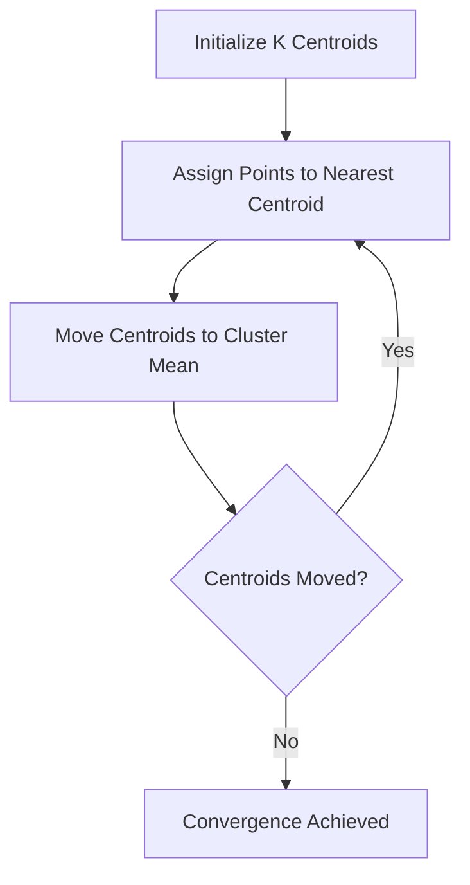

# 3.1.1 K-Means Clustering

K-Means is a centroid-based clustering algorithm that groups $N$ unlabeled points into $K$ distinct clusters. It treats the dataset as a physical space where "belonging" is defined by **Euclidean Distance**.

---

## 1. The Intuition: Retail Hubs
Imagine you are placing $K$ retail hubs in a city. You want to place them so that every resident's travel distance to their nearest hub is minimized. 

K-Means uses a simple "Assign and Move" loop:
1.  **Assign:** Every data point finds its nearest centroid and joins that "team."
2.  **Move:** Every centroid jumps to the **Average (Mean)** position of its team members.
3.  **Repeat:** Centroids move, teams change, and the process continues until the change in position is negligible (**Convergence**).

---

## 2. Initialization: K-Means++
Standard K-Means picks starting spots randomly, which can lead to clusters getting "stuck" on one side of the data. **K-Means++** ensures centroids are spread out using a **Weighted Lottery**:

1.  Pick the first centroid $\mu_1$ randomly.
2.  For every other point, calculate $D(x)^2$ (Distance to the nearest centroid, squared).
3.  The next centroid is picked with a probability proportional to its $D(x)^2$.
    - **Logic:** Points that are far away have "longer" lottery tickets and are much more likely to be chosen as the next hub.

---

## 3. Choosing the Optimal K

### Method A: The Elbow Method (Density)
We plot the **Within-Cluster Sum of Squares (WCSS)** against $K$. WCSS measures the total "waste" or distance people have to travel.

$$
\begin{aligned}
WCSS = \sum_{j=1}^{K} \sum_{i \in S_j} \|x_i - \mu_j\|^2
\end{aligned}
$$

As $K$ increases, WCSS always goes down. We look for the **Elbow Point** where the rate of improvement slows down.

<iframe src="https://www.geogebra.org/geometry?command=Polyline((1,9),(2,4),(3,1.5),(4,1.3),(5,1.2))%3BShowGrid(true)%3BShowAxes(true)&showToolBar=false&showAlgebraInput=false&showMenuBar=false" width="100%" height="400" style="border: 1px solid #e4e4e4; border-radius: 8px;" frameborder="0"></iframe>

### Method B: Silhouette Score (Separation)
While the Elbow method cares about how "tight" groups are, the Silhouette Score cares about how **segregated** they are.

For any point $i$, we calculate two distances:
1.  **$a(i)$ (Intra-cluster):** Average distance to points in its **own** cluster.
2.  **$b(i)$ (Nearest-cluster):** Average distance to points in the **next closest** cluster.

$$
\begin{aligned}
s(i) = \frac{b(i) - a(i)}{\max(a(i), b(i))}
\end{aligned}
$$

- **Score $\approx +1$:** Perfectly clustered (far from strangers).
- **Score $\approx 0$:** On the fence (halfway between groups).
- **Score $< 0$:** Misclassified (closer to the "other" group).

---

## 4. Conflict: When Elbow and Silhouette Disagree
Real-world data is rarely perfect. You might face a scenario where:
- **Elbow Method** suggests $K=2$.
- **Silhouette Score** suggests $K=3$.

**Why this happens:**
- **The Elbow Method** is obsessed with **Density**. If you have one giant, dense cloud of points, it will try to split it in half to reduce WCSS, even if there isn't a natural gap.
- **The Silhouette Score** is obsessed with **Gaps**. It would rather keep a giant cloud as one group (score $\approx 1$) and give two tiny, far-away clusters their own homes.

**Decision Rule:**
- Choose **Elbow** if your goal is to minimize total travel/error (e.g., placing delivery hubs).
- Choose **Silhouette** if your goal is to find distinct, unique identities (e.g., segmenting customer types).

---

## Navigation
- [Walkthrough: K-Means (Math) ->](sample-application-k-means.md)
- [Forward to Hierarchical Clustering ->](hierarchical-clustering.md)
- [^ Back to Chapter 3 Index](../c3-unsupervised-learning.md)