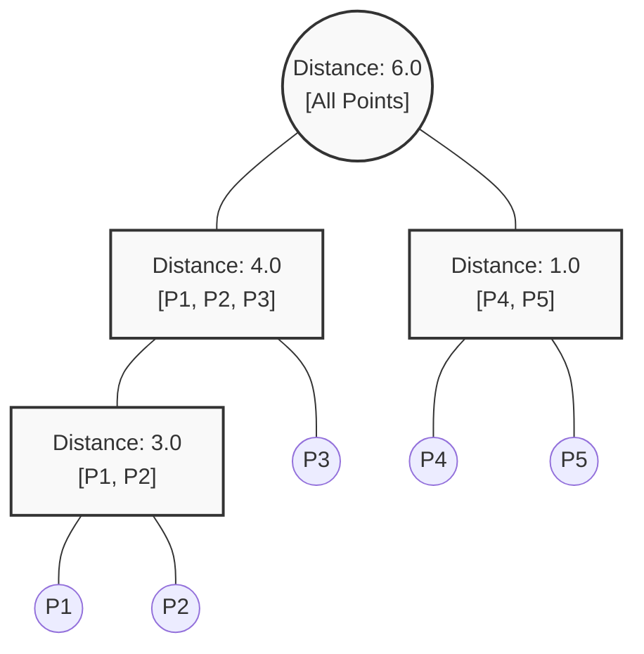

# Walkthrough: Hierarchical Clustering (Manual Trace)

In this walkthrough, we will trace the **Agglomerative (Bottom-Up)** clustering process using a simple 1D dataset and **Single Linkage**.

---

## 1. The Dataset
Imagine 5 houses on a single long street (a 1D number line).

**Table 1: Input Coordinates (Distances in miles)**

| Point | Coordinate (Mile Marker) |
| :--- | :--- |
| **P1** | 2 |
| **P2** | 5 |
| **P3** | 9 |
| **P4** | 15 |
| **P5** | 16 |

*At Step 0, we have 5 clusters: [P1], [P2], [P3], [P4], [P5].*

---

## 2. Iteration 1: The Initial Distance Matrix
We calculate the absolute distance between every pair of points.

**Table 2: Initial Distance Matrix**

| | P1 (2) | P2 (5) | P3 (9) | P4 (15) | P5 (16) |
| :--- | :--- | :--- | :--- | :--- | :--- |
| **P1 (2)** | 0 | 3 | 7 | 13 | 14 |
| **P2 (5)** | | 0 | 4 | 10 | 11 |
| **P3 (9)** | | | 0 | 6 | 7 |
| **P4 (15)**| | | | 0 | **1** 🏆 |
| **P5 (16)**| | | | | 0 |

**Action:** The smallest distance is **1.0** (between P4 and P5). 
We merge them into a new cluster: **[P4, P5]**.

---

## 3. Iteration 2: Updating the Matrix
Now we have 4 clusters: **[P1]**, **[P2]**, **[P3]**, and **[P4, P5]**.
We must recalculate the distances to the new cluster. Because we are using **Single Linkage (Min)**, the distance to the new cluster is the shortest distance to any of its members.

*Example: Distance from P3(9) to [P4(15), P5(16)] is Min(6, 7) = 6.*

**Table 3: Distance Matrix (Iteration 2)**

| | P1 | P2 | P3 | [P4, P5] |
| :--- | :--- | :--- | :--- | :--- |
| **P1** | 0 | **3** 🏆 | 7 | 13 |
| **P2** | | 0 | 4 | 10 |
| **P3** | | | 0 | 6 |
| **[P4, P5]** | | | | 0 |

**Action:** The smallest distance is **3.0** (between P1 and P2).
We merge them into a new cluster: **[P1, P2]**.

---

## 4. Iteration 3: Almost Done
Now we have 3 clusters: **[P1, P2]**, **[P3]**, and **[P4, P5]**.

**Table 4: Distance Matrix (Iteration 3)**

| | [P1, P2] | P3 | [P4, P5] |
| :--- | :--- | :--- | :--- |
| **[P1, P2]** | 0 | **4** 🏆 | 10 |
| **P3** | | 0 | 6 |
| **[P4, P5]** | | | 0 |

**Action:** The smallest distance is **4.0** (between P3 and the [P1, P2] cluster).
We merge them into a new cluster: **[P1, P2, P3]**.

---

## 5. The Final Merge and The Dendrogram
Finally, at a distance of **6.0**, the last two clusters **[P1, P2, P3]** and **[P4, P5]** merge into one giant cluster containing everyone.

Here is the visual history of those merges (The Dendrogram):

### Where to cut?
Look at the Y-axis values (Distances).
- Merge 1 happened at **1.0**.
- Merge 2 happened at **3.0**.
- Merge 3 happened at **4.0**.
- The final merge didn't happen until **6.0**.

The tallest vertical gap without a horizontal line interrupting it is between **4.0** and **6.0** (a gap of 2.0). 
If we draw a horizontal line at Distance = 5.0, we slice through exactly **2 branches**. 
The optimal $K$ for this street is **2 clusters** (The West Side: P1,P2,P3 and The East Side: P4,P5).

---

## Navigation
- [<- Back to Theory](hierarchical-clustering.md)
- [^ Back to Chapter 3 Index](../c3-unsupervised-learning.md)
