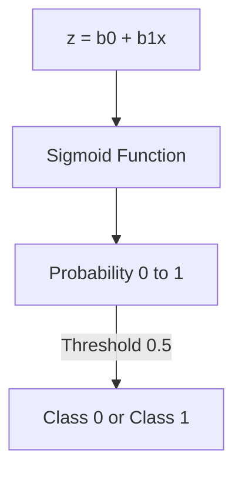

# 2.2.1 Logistic Regression

Despite its name, Logistic Regression is a **Classification** algorithm. It is used to predict the probability of a categorical dependent variable. 

While commonly used for binary classification (Yes/No), it is fully capable of handling multiple classes.

---

## 1. Regression vs. Classification: The Problem
In Linear Regression, the output is a continuous number (e.g., $ - \infty $ to $ + \infty $).
However, for classification (like "Is this email spam?"), we need an output between **0 and 1**.

**The issue with Linear Regression for classification:**
- It is sensitive to outliers, which can "tilt" the line and change the classification of many points.
- It can predict values $> 1$ or $< 0$, which makes no sense for probabilities.

---

## 2. Multi-class Classification

Can Logistic Regression handle more than two classes? **Yes**, through two main strategies:

### A. One-vs-Rest (OvR) / One-vs-All
- **How it works:** If you have 3 classes (A, B, C), you train **3 separate binary classifiers** (A vs. Others, B vs. Others, etc.).
- **Prediction:** You run the input through all three and pick the class with the **highest probability**.

### B. Multinomial Logistic Regression (Softmax)
This is the "true" multi-class version. Instead of training separate models, we build one single model that outputs probabilities for all classes at once using the **Softmax** activation function.

- **Weight Vectors:** The model learns a unique set of weights for every class.
- **Logits:** It calculates a raw score (logit) for each class before squashing them.
- **Normalization:** The Softmax function ensures all probabilities are positive and sum to exactly 1.0.

> **Deep Dive:** To see the math of how weights become logits, and how logits become probabilities, check out the [Multi-class Classification Examples (Fruit Classifier)](multiclass-examples.md).

---

## 3. The Solution: The Sigmoid Function
To fix the binary case, we "squash" the output of the linear equation through the **Sigmoid Activation Function**.

### The Formula:
$$\sigma(z) = \frac{1}{1 + e^{-z}}$$

Where $z$ is the linear prediction: $z = \beta_0 + \beta_1 X$.

### Properties:
- **Range:** Output is always between $(0, 1)$.
- **Threshold:** Typically, if $\sigma(z) \ge 0.5$, we predict Class 1. If $< 0.5$, we predict Class 0.
- **Interpretation:** The output is interpreted as the **probability** ($p$) that the input belongs to the positive class.

---

## 4. Decision Boundary
The Decision Boundary is the "line" that separates the classes. For a single feature, it is the point where $z = 0$ (and thus $\sigma(z) = 0.5$).

---

## 5. The Cost Function: Log Loss (Binary Cross Entropy)
We cannot use **Mean Squared Error (MSE)** for Logistic Regression because the Sigmoid function makes the MSE error surface "non-convex" (lots of local minima). Gradient Descent would get stuck!

Instead, we use **Log Loss**:

$$J(\beta) = -\frac{1}{m} \sum_{i=1}^{m} [y^{(i)} \log(h_\beta(x^{(i)})) + (1 - y^{(i)}) \log(1 - h_\beta(x^{(i)}))]$$

### The Intuition behind Log Loss:
- **If $y = 1$:** The second term becomes zero. We are left with $-\log(h_\beta(x))$. If the model predicts $0.99$, the loss is tiny. If it predicts $0.01$, the loss is massive (approaching infinity).
- **If $y = 0$:** The first term becomes zero. We are left with $-\log(1 - h_\beta(x))$. This penalizes predictions that are close to $1$.

> **Summary:** Log Loss rewards the model for being "confident and correct" and heavily penalizes it for being "confident and wrong."

---

## 6. Evaluation Metrics for Classification
Accuracy is often not enough (especially with imbalanced data). We use the **Confusion Matrix** to dig deeper.

| | Predicted: 0 | Predicted: 1 |
| :--- | :--- | :--- |
| **Actual: 0** | True Negative (TN) | False Positive (FP) |
| **Actual: 1** | False Negative (FN) | True Positive (TP) |

> **Deep Dive:** When is a False Positive worse than a False Negative? See [Confusion Matrix & Cost of Error](confusion-matrix-deep-dive.md).

### Key Metrics:
1.  **Precision:** $\frac{TP}{TP + FP}$ (Of all we predicted positive, how many were right?)
2.  **Recall (Sensitivity):** $\frac{TP}{TP + FN}$ (Of all the actual positives, how many did we catch?)
3.  **F1-Score:** $2 \cdot \frac{\text{Precision} \cdot \text{Recall}}{\text{Precision} + \text{Recall}}$ (The harmonic mean of the two).

---

## 7. Activation Functions Quick Reference

While Logistic Regression uses Sigmoid, it's the gateway to a family of **Activation Functions** used in Deep Learning.

| Function | Formula | Range | Problem Solved / Use Case |
| :--- | :--- | :--- | :--- |
| **Sigmoid** | $\sigma(z) = \frac{1}{1 + e^{-z}}$ | $(0, 1)$ | Binary Classification; Outputting probabilities. |
| **Tanh** | $\tanh(z) = \frac{e^z - e^{-z}}{e^z + e^{-z}}$ | $(-1, 1)$ | Zero-centered output; Usually preferred over sigmoid in hidden layers. |
| **ReLU** | $f(z) = \max(0, z)$ | $[0, \infty)$ | **Vanishing Gradient:** Fast to compute and helps deep networks learn faster. |
| **Leaky ReLU** | $f(z) = \max(0.01z, z)$ | $(-\infty, \infty)$ | **Dying ReLU:** Prevents neurons from becoming "dead" by allowing a small negative slope. |
| **Softmax** | $\frac{e^{z_i}}{\sum_{j} e^{z_j}}$ | $(0, 1)$ | **Multi-class Classification:** Ensures the sum of all predicted probabilities is exactly 1. |

---

## 8. Deep Dive: Deriving the Log Loss

You might wonder: *How did we arrive at that weird Log Loss formula?* It comes from a statistical method called **Maximum Likelihood Estimation (MLE)**.

### Step 1: The Probability Likelihood
For a single data point $(x, y)$, the probability of the outcome $y$ given the model's prediction $h$ is:
$$P(y|x) = h^y (1-h)^{(1-y)}$$
- If $y=1$, the term is just $h^1(1-h)^0 = \mathbf{h}$.
- If $y=0$, the term is just $h^0(1-h)^1 = \mathbf{1-h}$.

### Step 2: The Likelihood of the whole Dataset
To find the "best" model, we want to maximize the probability of seeing the **entire** dataset. We multiply the probabilities for all $m$ points:
$$L(\beta) = \prod_{i=1}^{m} [h_\beta(x^{(i)})]^{y^{(i)}} [1 - h_\beta(x^{(i)})]^{(1-y^{(i)})}$$

### Step 3: From Product to Sum (The Log Trick)
Maximizing a product is hard. But since $\log$ is a monotonically increasing function, maximizing $L(\beta)$ is the same as maximizing $\log(L(\beta))$.
$$\log(L(\beta)) = \sum_{i=1}^{m} [y^{(i)} \log(h_\beta(x^{(i)})) + (1 - y^{(i)}) \log(1 - h_\beta(x^{(i)}))]$$
The products become sums, and exponents become multipliers!

### Step 4: From Maximization to Minimization
In Machine Learning, we prefer to **minimize** a "Loss" rather than maximize a "Likelihood." To turn this into a cost function, we simply multiply by $-1$ and average it over the $m$ points:
$$J(\beta) = -\frac{1}{m} \sum_{i=1}^{m} [y^{(i)} \log(h_\beta(x^{(i)})) + (1 - y^{(i)}) \log(1 - h_\beta(x^{(i)}))]$$

**And that is the Log Loss (Binary Cross Entropy)!** It is literally just the negative log of the probability that the data occurred.

---

## Navigation
- [<- Back to Main Index](../../README.md)
- [^ Back to Chapter 2 Index](../c2-supervised-learning.md)
- [2.2.2 Support Vector Machines ->](#) (Coming Soon)
- [2.2.3 Naive Bayes ->](naive-bayes.md)
